# CAB303 Study Guide | 2022 Semester 2

Dr Vicky Liu | Notes for CAB432 at the Queensland University of Technology

<hr />

<h1>Table of Contents</h1>
<ul>
	<li><a href="#CAB303">CAB303: Networks</a></li>
	<ul>
		<li><a href="#week1">Week 1</a>: Introduction</li>
		<li><a href="#week2">Week 2</a>: Network Media, Ethernet, and Wi-Fi</li>
		<li><a href="#week3">Week 3</a>: Internet Protocol (IP) and IPv4 Addressing</li>
		<li><a href="#week4">Week 4</a>: Subnetting and Supernetting</li>
		<li><a href="#week5">Week 5</a>: Routing</li>
		<li><a href="#week6">Week 6</a>: TCP/IP Protocols and Architecture</li>
		<li><a href="#week7">Week 7</a>: Application-layer protocols</li>
		<li><a href="#week8">Week 8</a>: </li>
		<li><a href="#week9">Week 9</a>: </li>
		<li><a href="#week10">Week 10</a>: </li>
		<li><a href="#week11">Week 11</a>: </li>
		<li><a href="#week12">Week 12</a>: </li>
		<li><a href="#week13">Week 13</a>: </li>
	</ul>
</ul>

<hr /> 

<h1 id="CAB303">CAB303: Networks</h1>
<p>Building on your digital systems knowledge, you will be introduced to practical and theoretical knowledge on a wide range of modern networking topics to be able to design, implement and maintain network-based applications. You will participate in practical networking exercises to provide hands-on experience with network-based computing.</p>

<hr /> 

<h2 id="week1">Week 1: Introduction</h2>

### Advanced Research Projects Agency (ARPA)
The Advanced Research Projects Agency, know as the ARPANET, was formed by the US within the Department of Defense (DoD) in response to the USSR's first artificial earth satellite. It was developed to establish a US lead in science and technology in 1957.

### Network Control Protocol (NCP)
NCP was the first standard operational packet-switching protocol on ARPANET standardising the ARPANET network interface. NCP provided the middle layer of the protocol stack and enabling services such as email and file transfer allowing people to read and write data from computers and devices remotely by. Robert Khan and Vinton Cert took these concepts building upon NCP to develop TCP/IP.

### Interface Message Processor (IMP)
During 1960 to 1989, IMP was the primary packet switching node used to interconnect participating networks to the ARPANET. The IMP was the first generation of gateways with the documents being the first of a series of standardised documents published by the Internet Engineering Task Force (IETF). An IMP was a Honeywell DDP-516 mini-computer consisting of special purpose interfaces and software.

### Networking Terminology
- **Local Area Network (LAN)**
  - A network that interconnects devices within a limited geographic area. e.g. university campus, homes.

- **Wide Area Network (WAN)**
  - Uses the services of third-party communication providers to carry network traffic from one location to another.

- **Metropolitan Area Networks (MAN)**
  - Uses WAN technologies to interconnect LANs in a specific geographic region, such as a county of a city.

- **Inter-network**
  - A network collection of LANs that are tied together by devices such as routers.

- **Internet**
  - A worldwide public inter-network. Uses protocols such as TCP/IP and HTTP to transfer and view information.

- **Intranet**
  - A private inter-network in which devices and servers are only available to those users connected to the internal network.

- **Extranet**
  - An enterprise network that extends to external users (e.g. suppliers, vendors, partner, clients) to access internal resources.

### Packets (Frames, Bits, Segments)
Packets, also known by many names such as frames, bits, or segments, are small collections of data that are sent across a network. These collections contain information such as a source, destination IP address, data and more.

### Frames
Frames are packets that contain both a physical (MAC) and logical (IP) source and a destination address. The process of adding an IP address and MAC address to a chunk of data is called encapsulation. Information added to the front of the data chunk is called a header while information added to the end is called a trailer. 

When a packet is ready to be sent to the network access layer, the destinations MAC address must first be retrieved before the frames header can be created. TCP/IP retrieves this MAC address using the Address Resolution Protocol (ARP).

### Bits
A bit is a binary value typically represented by a 0 and 1 corresponding to an off and on electrical signal. Bits are the smallest incremental piece of data a computer can support.

### Packets and Frames
Computers typically transfer information across a network in short bursts consisting of around 1500 bytes of data. This is done due to many reasons:
1. It allows receivers to receive data from many other computers at the same time
2. Gives the receiving computer time to process the data 
3. Gives the sending computer the opportunity to receive data from other computers and perform other processing tasks
4. If an error occurs during transmission, only the chunks of data involved in the error need to be resent
5. Pauses between bursts allow other computers to transfer data during these pauses

### The Fundamentals of Network Communications
A computer network is a connection between two or more computers provided by cables or air waves. 

#### Network Interface Card (NIC)
An NIC is an add-on card that plugs into the motherboard expansion slot providing the computer a connection to the network. These come in two different types: wired and wireless.

#### Network mediums
A computer can connection to a connection by two different mediums:
1. An ethernet cable can be used to connect the NIC in a computer to a wired network device.
2. A wireless NIC can translate data into radio signals, transmitting these signals through the use of an antenna resulting in a wireless connection.

#### Interconnecting Device
An interconnecting device is used to allow two or more computers to communicate on a network without the need to connect directly to one another. There are a few common interconnecting devices such as:
- Routers: a router is used for connecting multiple networks together
- Switches: A switch is used for connecting multiple computers within a network
- Access Points (AP): Access points allow wireless devices to connect to a network

### Network Connectivity

- Peer-to-Peer
  - A Peer-to-Peer connection happens when a device connects directly to another device.

- Star Topology
  - A star topology connection occurs when devices connect to a singular access point whether wireless (AP) or wired (Switch).

### Software Components
- Network clients and servers
  - Network client software request information stored on another network computer or device
  - Network server software allow computers to share resources between each other
- Protocols
  - Protocols define rules and formats a computer must follow and use when sending packets of information across a network.
- NIC driver
  - An NIC driver receives data from protocols and forwards this data to the physical NIC

### Steps of Network Communication
1. An application tries to access a network resource by sending a message.
2. The client software formats this message and passes it along on to the network protocol.
3. The protocol packages the message in a format suitable for the network and sends it to the NIC driver.
4. The NIC driver finally sends data in a request to the NIC card to be converted into the necessary signals needed to be transmitted on the network.

### Layers of the Network Communication Process
These layers represent each step required for a client to access a network resource. Each layer has specific task with each layer working together.


### Network Architecture
Network architecture is the structural layout of a network including:
- Its physical components and their functional organisation and configuration
- Its operational principles and procedures
- Its data formats

There are two models that can be used when describing a networks architecture:
1. The TCP/IP protocol suite
2. The Open System Interconnection (OSI) model

Both of these models use layers to describe the software and hardware needed to transmit data between devices.

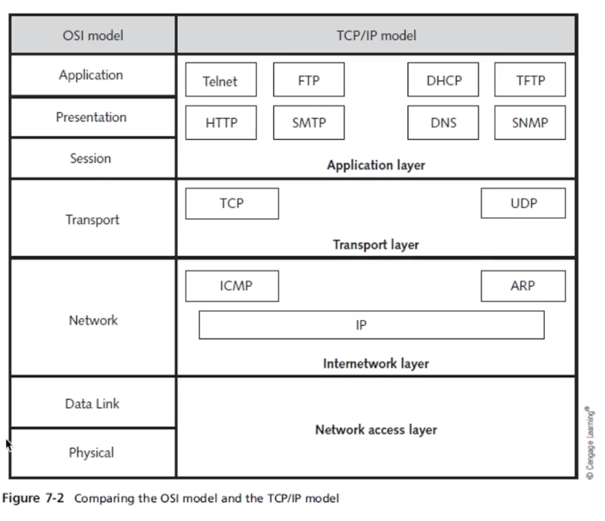

### The Open Systems Interconnection (OSI) reference model
The OSI model was proposed by the International Organisation for Standardisation (ISO) to provide a common framework for developers and students to learn from. It was designed to be applied to most networking protocols therefor is not specific to any protocol suite.

The OSI model is made up of seven layers and shows how data travels from one device to another on any given network. Each layer provides its services to the layer above until the data reaches the application layer where it provides the services to the user application. Each layer on a device behaves as if it were connecting with the same layer on the connecting device, this is known as peer communication between layers.

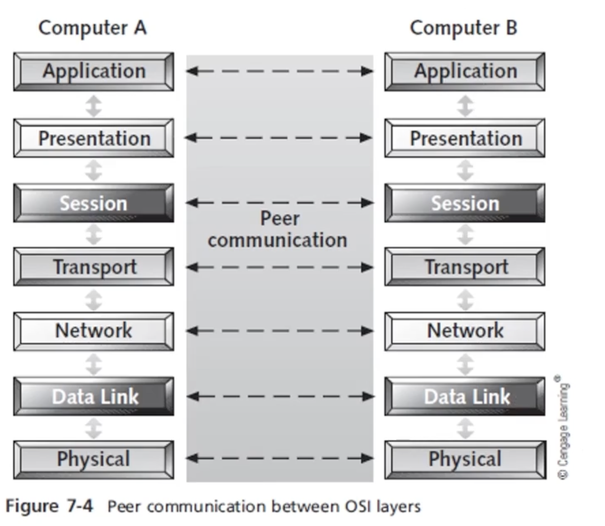

### Encapsulation in Networking
Control information is either added or removed from a layer depending on whether the data is being sent or received. The process of adding additional control information to data as it moves through each layer is called encapsulation. Encapsulation occurs in the sending device with the receiving device de-encapsulating the data.

The process of encapsulation can be shown through placing a letter into an envelope. On the envelope we write the address and sender's/receiver's name, this is the control information. The sender then places the letter into the envelope encapsulating the control information and contents of the letter. The receiver then removes the letter from the envelope thus de-encapsulating the control information and contents.

### OSI Layers

#### The Application Layer (Layer 7)
The application layer provides many interfaces for which a user can use to access networking services. 

**Common Protocols:**
- Hypertext Transfer Protocol (HTTP)
- File Transfer Protocol (FTP)
- Simple Mail Transfer Protocol (SMTP)

**Possible Problems:**
- Missing or misconfigured client or server software
- Incompatible or deprecated commands used to communicate between client and server

#### The Presentation Layer (Layer 6)
The presentation layer handles data formatting and translation and can support data encryption/decryption. For outgoing messages the data is converted into a format specified by the application layer. For incoming messages the conversion is reversed if required by the receiving application.

#### The Session Layer (Layer 5)
The session layer handles the creation and management of sessions, ongoing communications, between multiple devices. The layer handles connection setup ahead of data transfers and session shutdowns once the session ends.

The session layer also handles checkpointing and manages the mechanics of ongoing conversations such as identifying which side can transmit data when and how long for. 

**Common Network Functions:**
- Name lookup
- User login
- User logoff

#### The Transport Layer (Layer 4)
The transport layer manages the transfer of data from one application to another across a network. It does this by first breaking down the data into smaller chunks called segments. Segmenting is important because every network technology has a maximum frame size, called the Maximum Transmission Unit (MTU), and the data sent must not exceed this.

The transport layer also handles flow control and acknowledgements to ensure reliability as well as handling the re-sequencing of segments into the original data on the receipt.

**Common Protocols**
- Transmission Control Protocol (TCP): A connection-oriented protocol designed to provide reliable transfer of data.
- User Datagram Protocol (UDP): A connectionless protocol designed for efficient communication of small amounts of data.

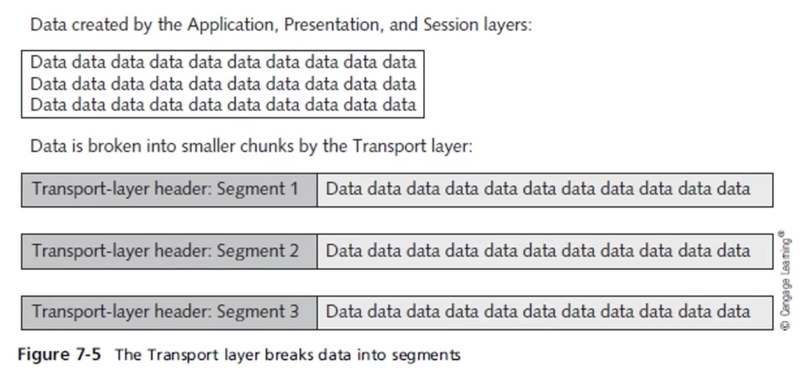

#### The Network Layer (Layer 3)
The network layer protocols main focus is on delivering packets in the most efficient way. It relies on protocols from the transport and application layers to provide reliability features as the network layer is considered a connection-less protocol. The IP protocol operates at this level with it being the heart of the TCP/IP protocol suite.

The network layer determines the best route a packet should take to get from network to network until it reaches its destination. Routers work predominately at the network layer with their job being to select the best path to the packets destination. 

The network layer performs many tasks such as
- Defining and verifying IP addresses
- Logical addressing
- Mapping logical network addresses (IP addresses) into physical addresses (MAC addresses).
- Routing packets through an internetwork e.g. selects the best path

**Common Protocols:**
- Internet protocol (IP)
- Address Resolution Protocol (ARP)
- Internet Control Message Protocol (ICMP)
- IPv4 and IPv6
- IPsec

**Possible Problems:**
- Incorrect IP addresses or subnet masks
- Incorrect router configuration
- Router operation errors

#### The Data Link Layer (Layer 2)
The data link layer is an intermediate layer between the network and physical layers which defines how computers access the network medium. The data link layer works with frames consisting of both a header and a trailer with the trailer component being labeled as a frame check sequence (FCS) which contains a Cyclic Redundancy Check (CRC) code. CRC is an error detecting code which is commonly used in network communications. NICs and switches operate at this layer.

**Possible Problems:**
- Collisions
- Invalid frames

#### The Physical Layer (Layer 1)
The physical layer deals with the incoming and outgoing messages. It converts bits into signals for outgoing messages and signals into bits for incoming messages. The physical layer also handles encoding with most components at this layer being repeaters and hubs.

**Possible Problems:**
- Incorrect media termination
- Electromagnetic interference or noise which scrambles a signal
- NICs and hubs can bne misconfigured or malfunctioning

<br />

<h2 id="week2">Week 2: Network Media, Ethernet, and Wi-Fi</h2>

### Network Media
- There are two major categories of network media: wired and wireless.
- There are two broad categories for cables: copper wire and fibre optic

The main differences between these two types are:
- Composition of signals, whether they use electricity or light
- Speed at which the signals can be sent
- Distance the signals can effectively travel

### Criteria for Choosing Network Media

- Bandwidth
  - How much data will need to be transmitted on the required network link?
  - What is the typical speed we would expect for our transfer rate to be useable?
  - How many users will be using the network at any given time?
- Distance
  - How far do we need a segment of the network to go?
  - What will be the maximum length of cable between two network devices?
  - Each cable type can only transport data so far before the connection begins to weaken
- Interference
  - Wireless connections can be disrupted by environmental obstacles or other devices running on similar bandwidths:
    - Computers, refrigerators, fans, lighting fixtures, or any other motorised devices
    - Weather conditions such as lightning and fog can effect wireless signal integrity 
  - Wired connections can be disrupted by other equipment producing electromagnetic interference:
    - 802.11b/g use an RF range of 2.4GHz
    - Devices sharing a channel can cause noise which in turn weakens other signals
    - Electromagnetic interference (EMI)
    - Radio Frequency Interference (RFI)
  - The density of objects can create interference or connection issues:
    - Concrete/steel walls are difficult for a signal to pass through
- Ease of Installation
  - How easy is the technology to install in the given location?
  - Need to consider the environment the connection is going to be in
- Total Cost 
  - The total cost of the installation, network media, and ongoing maintenance
- Mobility
  - Will the devices using the connection be moved around a lot or be fixed in-place?
- Security
  - How secure is the network media?
  - What data is being sent over the connection, is it sensitive?
  - What will happen if the data being sent is intercepted?
  - Copper wire is susceptible to electronic eavesdropping
  - Fiber-optic media carries light signals and therefor is not easily susceptible to interference or eavesdropping

  ### Bandwidth
  The network bandwidth is the total amount of data that can be carried from one point to another for any given time period (generally a second). This amount is expressed using bits per second (bps) with speeds generally measured in the millions of bits per second, megabits per second (Mbps), or billions of bits per second, gigabits per second (Gbps).

  <br />

  **Rates:**
  - 1 Mbps = 0.125 MB/s (Megabytes per second)
  - 100 Mbps = 12.5 MB/s
  - 1 Gbps = 125 MB/s

### Types of Cables

#### Coaxial Cable
Coaxial cables, or coax cables, were once the predominant form of network cabling. This was because it was relatively inexpensive and was easy to install while still providing a decent connection. Coaxial cables started to be phased out in the early 1990's but are still used today primarily in connecting cable modems to wall outlets installed by TV/internet providers.

#### Twisted-Pair Cable
These cables are used in most local area network connections. There are two types of twister-pair cables:
- Unshielded Twisted-Pair (UTP)
  - This are the most commonly used one out of the pair
  - Cheaper to use
  - More flexible than the shielded version
- Shielded Twisted-Pair (STP)
  - Cables are shielded to help stop interference from electromagnetic noise
  - More expensive

Twisted pair cabling is classified by categories with twisted pair cables currently being in category 1 through to category 8 although categories 1, 2 and 4 are nearly obsolete. Categories 5e, 6, and 7 UTP cabling is the most popular type of UTP used now days.

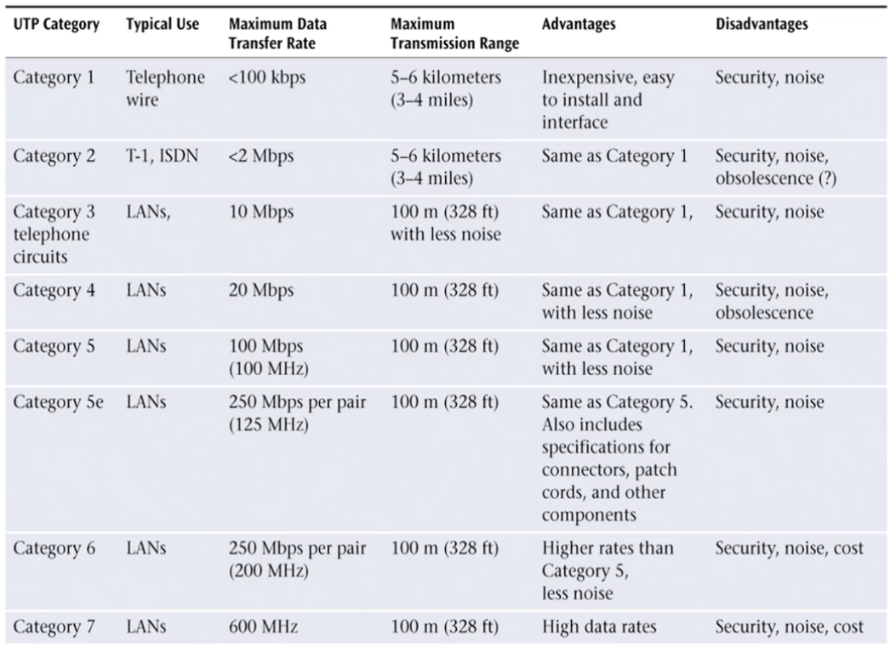

The twists in the wires are necessary to improve their resistance to crosstalk from other wires and EMI from outside sources. Shielding can additionally be layed on to eliminate more interference.

Twister-pair cables use RJ-45 connectors to connect to computers, hubs, switches and RJ-45 wall jacks. To put RJ-45 plugs on the end of twisted-pair cable the wires are punched down into terminal blocks on a jack or patch panel.

Some common tools used in this process are:
- Wire cutters
- Crimping tool
- Cable tester
- Punchdown tool
- Cable stripper
- RJ-45 plugs/jacks

It's important when making a cable or terminating a cable at a jack or path panel that the colour wires are arranged in the correct order. There are two standards from the Telecommunications Industry Association (TIA)/Electronic Industries Alliance (EIA):
- T-568A
- T-568B

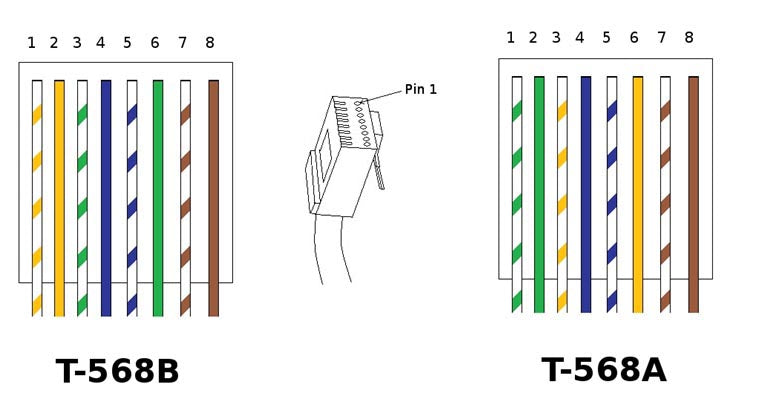

#### Fiber-Optic Cable
Fiber-optic cables transmit pulses of light instead of electrical signals. These cables are composed of a cylinder of glass fiber called the core encased in a concentric layer of glass called the cladding. Finally the fiber is jacketed in a thin transparent plastic material called the buffer.

Information is sent in a beam of light bouncing down the glass or plastic pipe. These cables provide a high data capacity over long distances immune to electrical interference and eavesdropping. As expected however, there are higher installation and maintenance costs tied to these cables:
- They are more difficult and time consuming to install
- The connectors and test equipment required are relatively more expensive than the copper substitutes
- Birds typically peck at the fiber cable jackets to use as bits of nesting material
- Beavers and mice use exposed fiber cables to sharpen their teeth
- Ants like to eat the plastic shielding
- Sharks have been known to damage fiber cabling when laid underwater

There are two major types of fiber-optic cables:
1. Single-mode fiber (SMF):
    - Includes a single, small-diameter fiber at the core (8 microns)
    - Generally uses a laser light source
    - Spans the longest distance of the two
    - Generally used in higher-bandwidth applications
2. Multi-mode fiber (MMF)
    - Uses a larger diameter fiber at the core (50 and 62.5 microns)
    - Costs less that SMF
    - Uses an LED for its light source
    - Spans shorter distances

#### Serial Communications
A serial link is a point-to-point link between two devices where bits are transmitted sequentially over a single channel. In theory, transferring bits in parallel is faster however, this method suffers from problems with synchronisation and higher costs.

The original serial standard, RS-232, was introduced in the 1960s and is now mostly replaced by USB.

### Straight-Through vs Crossover Cables
Standard path cables are considered straight-through cables as the same wiring standard is used on both ends of the cable. Crossover cables on the other hand use the T-568A standard on one side of the cable and the T-568B standard on the other side.

Crossover cables cross the transmit and receive wires so that the transmit on one end connects to the receive on the other. This is usually needed when two devices of the same type need to be connected to one another.

The need for crossover cables has been eliminated in todays time with advancements in equipment. G/Ethernet comes with automatic medium-dependant interface crossover (Auto-MDIX) detecting whether a crossover or straight-though cable is needed and automatically configuring the network interface card accordingly. There are however, still cases in which crossover cables are still needed when connecting devices of the same type together.

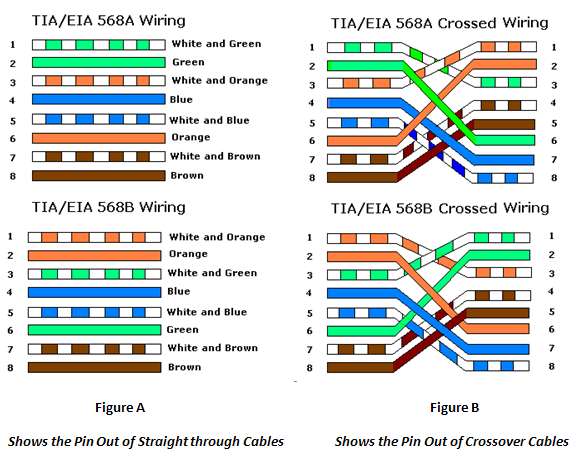

### DTE vs DCE Devices
Devices that communicate over a serial interface are divided into two types:
1. Data Terminal Equipment (DTE)
    - An end instrument that is used to convert user information into signals or re-convert received signals.
2. Data Communications Equipment (DCE)
    - Typically, a modem or other piece of data communications equipment

When a connection between two DTE devices is needed without a modem, a special type of cable called a null modem is required. Generally, DCE devices provide the clock rate while the DTE device synchronises with that provided clock rate.

### Benefits of Wireless Connections
- Wireless connections create a temporary connection to wired connections
- Establishes backup or contingency connectivity for existing wired networks
- Extends a networks span beyond the reach of wire-based or fiber-optic cabling. This is especially useful in older buildings where rewiring may be too expensive
- Wireless allows businesses to provide customers with access to the internet without the need for them to hook any wires up
- Allows users to move around the office without the restrictions of moving wires or physical connections

### Wireless LAN Components
There are many components that help provide a device with wireless LAN capabilities:
- The network interface attaches to an antenna and an emitter instead of a cable
- A wireless access point (AP)
  - This is a device which has an antenna and transmitter to send and receive wireless traffic
  - Has ports to connect to the wired side of the network
  - Shuttles traffic back and forth between a networks wired and wireless sides
  - Most small business and home networks use a wireless router to do this. A wireless router is a device which combines the functions of an AP, a switch and a router all in one.

### Wireless vs Wired Networking
- Speed
  - Wired ethernet is faster than wireless however Wi-Fi has become faster over the recent years
- Stability
  - Wireless is more susceptible to environmental factors as radio waves can be blocked by walls and floors and can interfere with microwaves, cordless phones and more
- Mobility, installation and convenience
  - Wi-Fi allows for greater mobility of devices as they are not restricted by cabling
- Security
  - Wireless transmissions can be intercepted easier than wired transmissions

### Media Access Controller (MAC) Addresses
MAC addresses are unique 48-bit addresses expresses in 12 hexadecimal digits that are stored in ROM on the NIC. This 48-bit address is made up of two 24-bit numbers with one half referred as the manufacturer ID (OUI) and the other being the device's unique serial number assigned by the manufacturer. 

The broadcast MAC address is ff-ff-ff-ff-ff-ff.

### Wireless NICs
Wireless NICs must be chosen according to the type of wireless AP being used. Typically this would either be 802.11ac, 802.11ax, 802.11ax-2021 or 802.11 a/b/g/n where each letter refers to the wireless network standard the device supports.

Wireless NICs connect to a network using a service set identifier (SSID) which is the name assigned to the wireless network. Depending on the networks security configuration, a security key or username and password may need to be entered for access.

An NIC has many functions depending on what connection is being processed.

For incoming messages the NIC will:
- Receive bit signals and assemble them into frames
- Verify the destination address
- Remove the frame header and sends the resulting packet to the network protocol

For outgoing messages the NIC will:
- Receive packets from the network layer
- Create frames by adding MAC addresses and error checking
- Convert frames into bit signals suitable for the medium and transmit them

### Ethernet
Ethernet is a wired connection used in LAN, MAN and WAN networks. It was introduced in 1980 and standardised in 1983 as IEEE 802.3. The protocol has evolved and improved over time with the system now having three main speeds:
- 10Mbps
- 100Mbps
- 1000Mbps

Ethernet can support 10Mbps all the way to 10Gbps with most NICs/switches operating at 10/100/1000Mbps.

### Ethernet Media Access
Media access method is a set of rules governing how and when that medium can be accessed for transmission. Ethernet uses Carrier Sense Multiple Access with Collision Detection (CSMA/CD):
- Carrier Sense: The connection must listen and hear silence before sending data
- Multiple Access: If two or more stations hear silence, multiple stations are allowed to transmit data at the same time
- Collision Detection: If two or more stations transmit at the same time and a collision occurs and is detected by the NIC, all stations must retransmit the sent data

Ethernet handles errors using the best-effort delivery system, you hope the data gets to the destination but there is no acknowledgement either way. It's the job of the network protocols and applications to ensure the delivery of data. 

Ethernet will detect damaged frames by using the error-checking code in the frames trailer, this is called a Cyclic Redundancy Check (CRC). Ethernet can also use CRC to detect if any data has been changed during transmission. If a frame is detected as damaged, it is discarded with no notification.

### Ethernet Addressing
In ethernet, each station has a physical MAC address. Incoming frames must match the NIC's address or broadcast address and, once processed by the NIC, the incoming frames are sent to the network protocol for further processing.

### Ethernet Frames
Ethernet has four different frame types depending on the protocol being used to send the frame.

The ethernet II frame type is used by TCP/IP where each frame must be between 64-1518 bytes. Each frame consists of:
- Destination MAC
- Source MAC
- Type
- Data
- FCS

### Ethernet Standards
Ethernet standards are expressed through an XbaseY format where x designates the speed of transmission and Y specifies the type of media (T = twisted-pair, FX = fiber optic).

#### 10BaseT (outdated)
- Uses two of the four wire pairs
- Runs over Category 3 or higher UTP cabling
- Is highly susceptible to collisions and is now obsolete

#### 100BaseTX
100BaseTX is a common variety of Ethernet.
- Uses two of the four wire pairs
- Runs over Category 5 or higher UTP
- There are two types of 100BaseTX hubs
- Switches can be used to interconnect multiple hubs

#### 100BaseFX
100BaseFX is the fiber optic standard of Ethernet.
- Runs over two strands of fiber optic cabling
- Is typically used as the backbone cabling between switches
- Used to connect clients or servers when there is a need for the transmission to be immune to noise and eavesdropping

#### 1000BaseT Ethernet
1000BaseT Ethernet, also know as Gigabit Ethernet, runs over Category 5 or higher UTP and uses all four wire pairs.

#### 10GBaseT Ethernet
- Runs over four pairs of Category 6A or 7 UTP
- Only operates in full-duplex mode
- Is considered an expensive option even today
- Very useful for network servers as it allows them to keep up with desktop systems which typically operate at 1Gbps

#### 100BaseT4
- Uses all four pairs of wires in UTP Category 3 cable
- Is now considered obsolete

#### 1000BaseLX
- Uses fiber-optic media
- The "L" stands for "Long wavelength" laser
- Supports a maximum cable segment length of 5000 meters

#### 1000BaseSX
- Uses fiber-optic media
- The "S" stands for "Short wavelength" laser
- Cannot cover as much distance as long-wave lasers but is cheaper in comparison

#### 1000BaseCX
- Uses specially shielded, balanced, copper jumper cables
- Is also called "Twinax" or "Short-haul" copper cables

#### 10 Gigabit Ethernet IEEE 802.3ae
- Defined to only run on fiber-optic cabling
- Specifies a maximum distance of 40km
- This standard is primarily used for network backbones
- Has many varieties such as:
  - 10GBaseSR, 10GBaseLR, 10GBaseER, 10GBaseSW, 10GBaseLW, and 10GBaseEW

#### 40 Gigabit and 100 Gigabit Ethernet
- Fiber-optic cabling is the primary medium although there are provisions to use special copper assemblies over short distances.

### Wi-Fi
802.11 wireless networking standard, also called Wireless Fidelity (Wi-Fi) is essentially an extension to ethernet using airwaves instead of cabling. Wi-Fi can operate in one of two modes:
- Infrastructure:
  - The most common mode of Wi-Fi
  - Uses a central access point (AP)
- Ad hoc:
  - Uses no central device with data traveling from device to device like a bus
  - This is sometimes referred to as "Peer-to-Peer" mode

Wi-Fi can operate at 2.4Ghz and 5.0GHz frequencies with:
- 2.4GHz actually being 2.412 through to 2.484 divided into 14 channels spaced 5MHz apart
- 5.0GHz actually being 4.915 through to 5.825 divided into 42 channels of 10, 20, 40, 80, and 160MHz each


### Wi-Fi Access Methods and Operation
Unfortunately with Wi-Fi, a sending station cannot hear if another station has begun transmitting or not so it is unable to use CSMA/CD. Instead Wi-Fi devices use Carrier Sense Multiple Access with Collision Avoidance (CSMA/CA). This can optionally be used with request-to-send/clear-to-send (RTS/CTS) packets and acknowledgements.

CSMA/CA Protocol Steps:
1. Sender node (A) has some data to transmit
2. (A) checks if the media is free or not
  - Optionally, the sending not can transmit an RTS (Request to Send) packet to the access point
3. The sending node waits until all nodes have had time to receive the jam signal
4. Access point replies with a CTS (Clear to Send) packet
5. During transmission, the node monitors the media for an RTS signal from other surrounding nodes that may already be mid-transmission. If an RTS signal is received, it stops transmitting and retries after a random delay.

### Wi-Fi Security
Due to the fact that Wi-Fi can transmit data hundreds of feet away there is the fear that this data can be intercepted without you ever knowing. Wi-Fi should be protected by an encryption protocol that makes this data difficult to intercept and interpret. 

There are many encryption protocols with the main three being:
- Wired equivalent privacy (WEP)
- Wi-Fi protected access (WPA) as well as WPA2 and WPA3

However, not all devices support all three protocols. Older devices might only support WEP and/or WPA.

<br />

<h2 id="week3">Week 3: Internet Protocol (IP) and IPv4 Addressing</h2>
* Note: Many of the notes taken for this week have been appended to their appropriate sections found earlier in this guide.

### Defining and Verifying IP Addresses
Once a device connects to the internet it will be assigned an IP address. This IP address is made up of two parts:
1. A network ID
2. A host ID

An IP address has two main purposes:
1. To identify a network device at the Internetwork layer
2. To identify the network on which a device resides 

When a device receives an IP packet, it first compares the destination IP address to its own. If the destination IP matches or is a broadcast, the packet is then processed. If however it does not match then the packet is discarded.

### IPv4 and IPv6
IPv4 and IPv6 are both protocols found at the network layer with IPv4 being the most common one currently (2022). IPv4 was created in 1977 and has a physical limitation of 4.3 billion IP address. IPv6 was created in the 1990s yet has not seen widespread adoption. It is however, slowly being used more often with more providers offering IPv6 support.

**IPv4 Header Breakdown:**
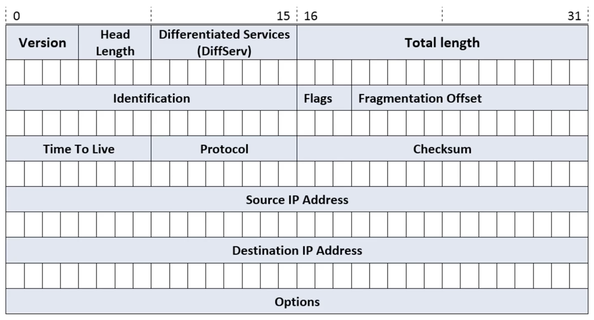

- Version
  - Indicates which version of the IP protocol is being used: IPv4 or IPv6.
- Header Length
  - Denotes the length of the IP header.
- Differentiated Services
  - Specifies a packets priority and informs routers the level of priority that should be applied when processing the packet.
- Total Length
  - Denotes the total length of the IP packet. This includes the header and data.
- Identification (16 bits)
  - A unique identifier value for the packet. If a packet is fragmented then the same Id value is used in each fragment.
- Flags (3 bits but the first is not used)
  - Specifies whether fragmentation is allowed or not
  - Indicates whether the packet has been fragmented or not
    - If fragmented, also indicated if it is the last in the fragment
  - 'D' means 'Do not fragment bit' while 'M' means 'More fragment bit'
- Fragmentation Offset (13 bits)
  - Indicates how to reconstruct the fragmented packets.
  - The first fragment has an offset of zero with the rest being offset in units of 8 bytes measured from the original datagram.
  - Only the first byte number of each fragmented packet is recorded.
- Time to Live (TTL)
  - Denotes the remaining lifetime of the packet
- Protocol
  - Indicates which transport layer protocol received the packet: TCP or UDP.
- Header Checksum
  - Allows the receiving device to calculate if the IP header has been tampered or corrupted during transmission.
- Source IP Address
  - The IP address of the source node.
- Destination IP Address
  - The IP address of the destination node.

### IP Fragmentation
IP fragmentation is a required for most data transfers. This is due to the fact that every network has a unique limit e.g. the maximum transmission unit (MTU) for the size of datagrams that can be processed at any given time.

If a datagram that's being sent it too large for the receiving servers MTU, then the datagram must be fragmented into smaller sizes in order to be successfully transmit.

IPv4 fragmentation comes with its downsides however:
- Fragmentation requires much more overhead for the receiving device due to the need to allocate memory for the arriving fragments and the need to reassemble the fragments.
- If a single fragment of an IPv4 datagram is dropped, the entire original datagram must be resent

<br />

<h2 id="week4">Week 4: Subnetting and Supernetting</h2>

### Subnetting
Subnetting is the act of splitting up an address range into a group of smaller networks. We do this so at the end we have multiple smaller sub-networks which allows us the benefit of:
- Reduced congestion by allowing fewer devices into the subnet
- Dividing a network into logical subnets
- Allowing multiple supported network technologies
- Supporting WAN by allowing geographical separated LANs to use a single network ID

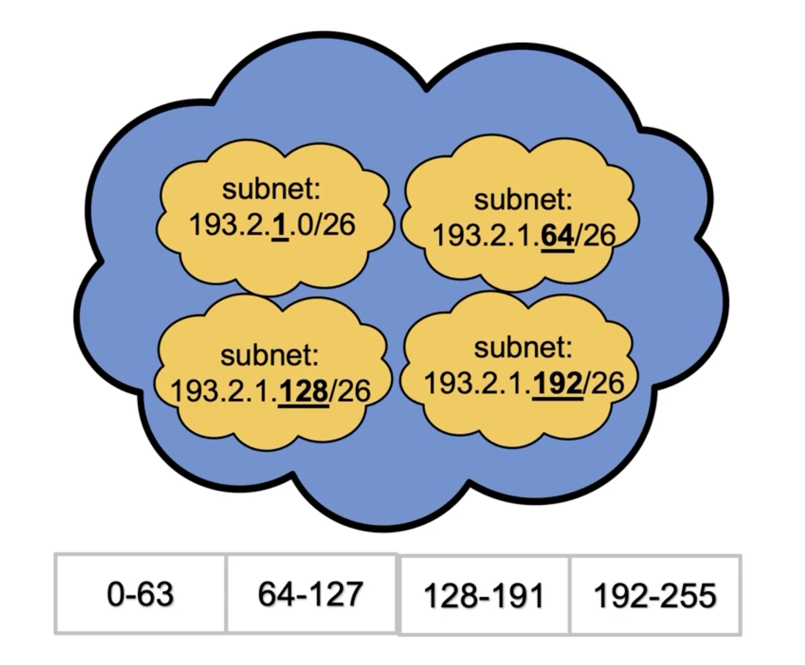
**Figure 1: The network is seen externally as `193.2.1.0`.**

With subnetting we may sometimes end up with a large number of IP addresses that need to be managed. To combat this we can break the host ID portion of the address down into a subnet ID and host ID. For example, a subnet mask of `255.255.255.0` applied to a class B address would be broken down such that the host ID, usually consisting of 16-bits, would now consist of an 8-bit subnet ID and an 8-bit subnet host ID.

When we subnet we change the structure from a two level address to a three level address. It's important to note that external networks do not know about the subnet/host ID details, they only see one complete network.

When deciding on how to derive a subnet mask we must first:
- Decide how many subnets are needed
- Decide how many bits are needed to meet/exceed the number of required subnets. We can use the formula $2^n$ where $n$ represents the number of bits that must be added to the started subnet mask.
- Borrow bits from the top of the host portion of the address down
- Ensure that there exist enough host bits to assign to computers on each subnet, calculated using $2^n - 2$ where $n$ represents the number of host bits left in the host ID

It's important to note that when subnetting there are two main rules we need to follow:
1. Host bits cannot be all zero's, this is the subnet ID
2. Host bits cannot be all one's, this is the broadcast address

### Calculating a Subnet Mask
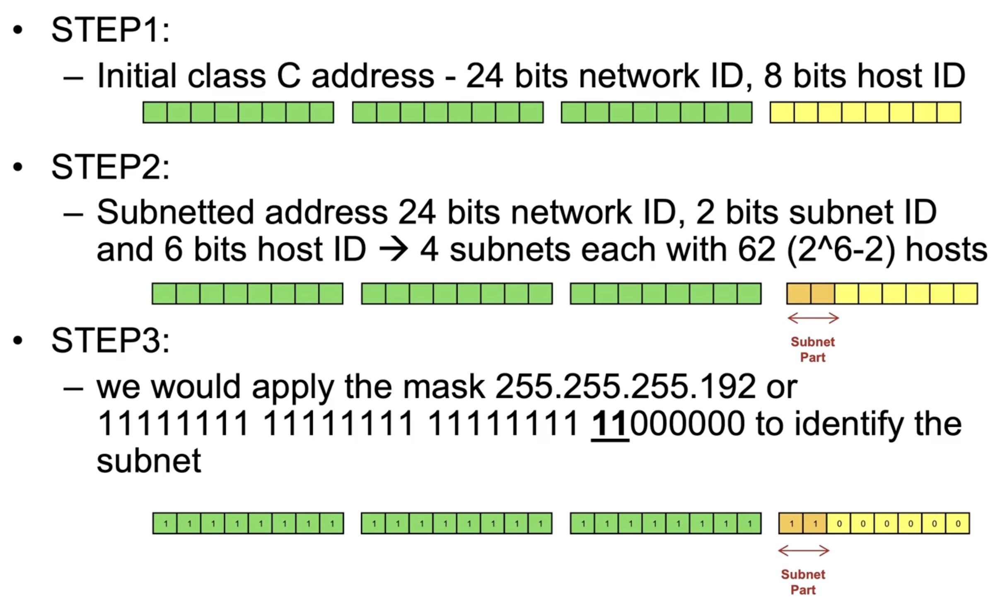

*Note: Diagram taken from QUT slides.

### Variable Length Subnetting (VLSM)
VLSM is a way of subnetting a subnet to reduce the waste of IP addresses by borrowing an extra bit from the host bits. Suppose we have a class C address `212.5.5.0` and we require 3 subnets with 60 hosts and 2 subnets with 30 hosts. We need 5 subnets in our example but due to a $2^n$ limitation, our only options would be 4 or 8 subnets. Using VLSM we can subnet our address into 4 subnets of 60 hosts and then subnet one of the subnets into 2 more subnets consisting of 30 hosts.

### Supernetting
Supernetting, or network summarisation, is the act of combining a group of continuous subnets into a single network by borrowing bits from the network portion and putting them into the host portion. It's used for route aggregation as a way of reducing the size of routing tables. There are a few benefits to supernetting such as:
- Minimizing latency in a complex network structure
- Reducing the overhead for the routing process
- Improving network stability by reducing unnecessary routing updates
- Reducing processor workloads, memory requirements, and bandwidth demand

For example, we may have two subnets, `193.2.1.0/25` and `193.2.1.128/25`. We can then take these two subnets and supernet them back into a single network, `192.2.1.0/24`.

### Calculating a Supernet
Let's say we have 4 continuous class C addresses that we want to supernet. $\log_2 4 = 2$ shows that we need to borrow 2 bits from the network portion. This means our mask would become `11111111.11111111.11111100.00000000` or `255.255.252.0` and the possible addresses we have now are:
- `212.5.4.0` = `11010100.00000101.00000100.00000000`
- `212.5.5.0` = `11010100.00000101.00000101.00000000`
- `212.5.6.0` = `11010100.00000101.00000110.00000000`
- `212.5.7.0` = `11010100.00000101.00000111.00000000`

### Classless Interdomain Routing (CIDR)

<br />

<h2 id="week5">Week 5: Routing</h2>

### Routing
In terms of networking, routing is the process of forwarding packets of information from one place (source) to another (destination). This process is usually performed by a dedicated device called a router and involves selecting the best route for the packet to reach the final destination.

Routing is a major fundamental feature of the internet as it enables packets of information to jump from one device to another until it reaches its final destination. Each intermediary node performs routing by passing along the packet to the next node. 

### Routers
As mentioned earlier, a router is a dedicated device that performs the routing of packets across a network. Routers operate at the network layer and connect separate logical networks to from an internetwork. In order for a router to forward packets to other networks it must have two of more interfaces, or ports.

Routers are cable of being used to create complex internetworks designed with multiple paths creating fault tolerance and load sharing. We can image these complex internetworks essentially as a weighted network graph with each edge, or link, between nodes having a cost associated to them. These costs could consist of:
- A hop count
- A queue size cost
- A limiting speed
- Dollar amount for link usage

All of this information is stored in something called a routing table which is used to determine the best path to forward packets.

### Routing Administration
As a routing administrator, the possible roles you will take on are:
- Assigning each router on the network an IP address via the routers interface
- Selecting the routing protocols that are to be used
- Building and enabling routing tables
- Testing and monitoring the routing of packets

### Routing Process between Routers

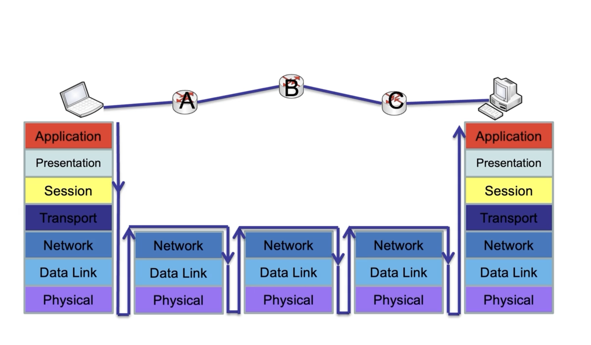

- Step 1: The router de-encapsulates the layer two frame header and trailer to expose the layer three packet.
- Step 2: The router then examines the destination IP address and uses the routing table to determine the best path.
- Step 3: If the router finds a valid path, it encapsulates the layer three packet into a new layer 2 frame and sends it to the next hop.

### Algorithm for the Routing Process
When the router receives a packet, it first evaluates the time to live (TTL). 

- If the TTL is equal to zero, then:
  - The router will discard the packet and send an ICMP time exceeded message to the source.

- If the TTL is greater than zero, then:
  - The router will decrement the TTL by one.
  - The router will exam the destination IP
  - The router will use the routing table to determine the best path to the destination. If the router finds a valid path, it will encapsulate the packet into a new data link frame of the outgoing interface and send it to the next hop. If the router does not find a valid path, then the router will send an ICMP destination unreachable message and discard the packet.

### Routing Table
Routing tables are tables comprised of network addresses and interface pairs. This data tells the router which interface a packet should be forwarded to.

**Types of routing table entries**:
- Directly connected network: A network that is directly connected to one of the routers interfaces.
- Remote network: A network that is not directly connected to the router. To reach a remote network the packet must be sent to another router connected to this network.
- Default routes (quad-zero route): Any packet with a destination address that is not in the routing table will be sent to the default route. This is expressed as `0.0.0.0/0`.

**Routing table entries generally consist of**:
- A destination network: Generally expressed in CIDR notation such as `172.16.0.0/16`
- The next available hop: Indicated by an interface name or the address of the next router in the path
- The metric: A numerical value telling the router how "far away" the destination network (cost) is as well as the total number of routers a packet must travel through (hop count)
- The Timestamp: Indicates how long it has been since the routing protocol updated the dynamic route

### Static Routing
Static routing is when a network administrator manually configures, creates and updates the routing table. This is an effective method for configuring and managing a routing table for smaller and predictable networks. However, this method does not scale well for complex, large networks or networks that dynamically change.

**Advantages:**
- Easy to implement and maintain in a small network
- Very little overhead
  - No need for a routing algorithm
  - No extra resources

**Disadvantages:**
- Not easy to implement in a large network
- If a link fails, a static route cannot reroute traffic, it will need to be manually fixed

**Static routing is preferred when:**
- The network consists of only a few routes
- The ISP represents the only exit point to the Internet
- A network is configured in a hub-and-spoke topology
- Access a single default route

### Dynamic Routing
Dynamic routing is when the routers themselves communicate with each other exchanging routing information. This process is done in three main stages:
1. Initialisation
2. Sharing
3. Updating

Before the router can process and calculate the received routing information, a network administrator must define which routes are to be advertised on a router. 

Convergence is achieved when a set of routers have the same topological information from each other.

**Advantages:**
- Suitable in all topologies where mutliple routers are required
- Automatically adapts topology to reroute traffic if possible
- Ability to sense and recover from network faults. If a router goes down, other routers can detect the fault and update the routing table to reflect that.

**Disadvantages:**
- Can be much more complex to implement
- Requires additional resources such as CPU, memory and link bandwidth for routing updates

**Dynamic routing is preferred when:**
- The network is of medium-large sizing or complex
- There is automatic updating of routing table entries facilitated by a routing protocol

### Dynamic Routing Categories

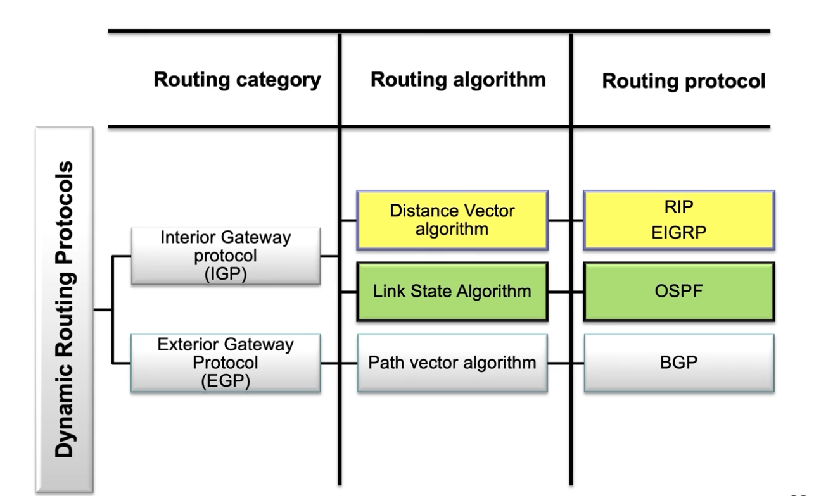

**Interior Gateway Routing Protocols (IGP)**
Used for routing inside an autonomous system (AS) e.g. RIP, EIGRP, OSPF

**Exterior Routing Protocols (EGP)**
Used for routing between autonomous systems (AS) e.g. BGP

### Dynamic Routing Algorithms

#### Distance Vector Algorithm 
Based on the Bellman Ford algorithm, the distance vector algorithm is a dynamic routing algorithm where:
- On boot, a router will initialise its routing table containing an entry for each directly connected network.
- Each router will then periodically share its knowledge about the entire routing table to all its interfaces e.g. "I can reach destination x at distance y via z".

**Disadvantages:**
- Performance poor in large networks

#### Link State Algorithm
Based on the Dijkstra's Least-Cost algorithm, the link state algorithm is a dynamic routing algorithm where the algorithm finds every possible path between two locations and in doing so the least cost path is found. It does this by having each router generate information about only its direct connected links, building adjacencies with neighbouring routers. 

Link state advertisements (LSAs) are exchanged throughout the network in order to update routing tables. 

**Advantages:**
- Routers don't periodically send out their routing table. Updates are broadcast only on startup and when a link state changes.
- Low network overhead and convergence time
- Ability to scale to large networks

**Disadvantages:**
- More complex and difficult configuration

<br />

<h2 id="week6">Week 6: TCP/IP Protocols and Architecture</h2>

### TCP/IP Architecture Model
The TCP/IP model is a model consisting of four layers created by the department of defence of the US in the 1970s. The core protocols of the TCP/IP model, as suggested by the name, is TCP and IP. Both of these protocols operate in the transport and network layers of the OSI model and provide basic services to protocols in other layers.

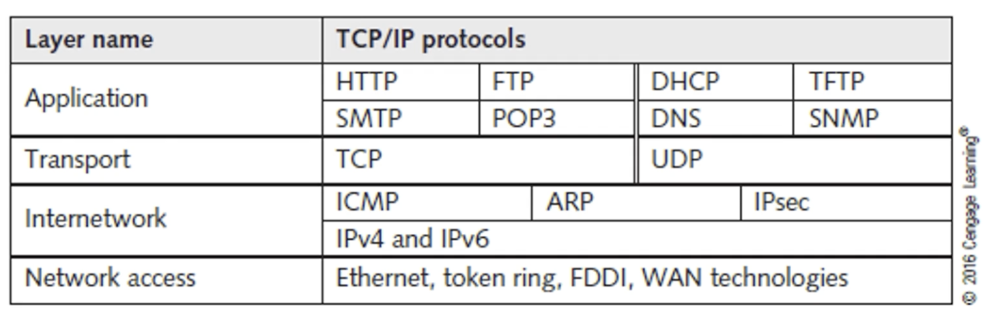
**Figure 1: TCP/IP Architecture Model Diagram**

The TCP/IP model is used to describe general guidance for the design and implementation og specific networking protocols and communication. TCP/IP specifies how data should be formatted, addressed, transmitted, routed, and received at the destination to ensure end-to-end connectivity.


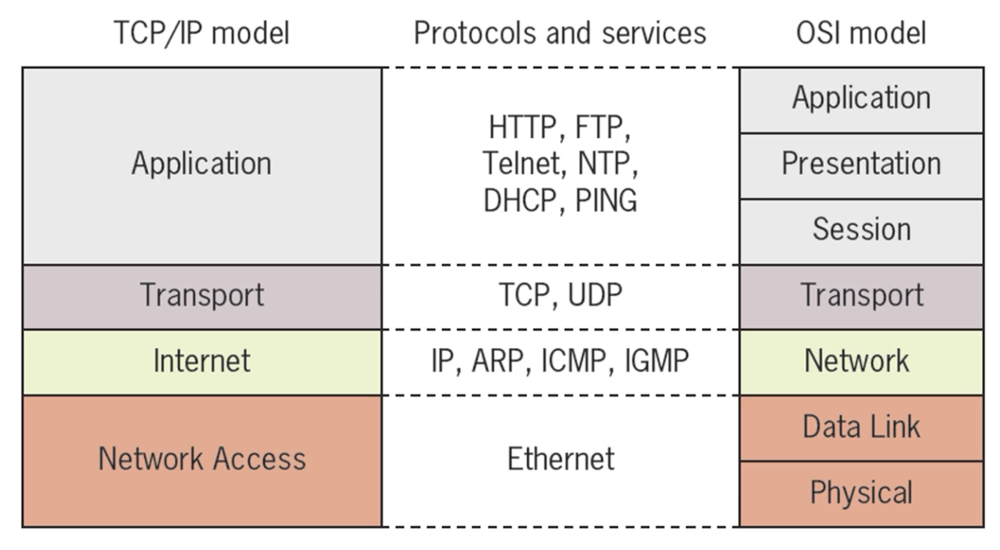
**Figure 2: TCP/IP vs OSI**

### Transport Layer Functions
One of the main functions of the transport layer is to ensure traffic can be separated for different applications running on the system. This is achieved using port numbers which are a way to identify specific port numbers. These port numbers are used to identify a specific process or application that the information needs to be sent to.

TCP and UDP both use 16-bit port numbers that are appended into the header.

Another function the transport layer provides is the ability to protect data integrity. TCP and UDP both provide checksum functions like a cyclic redundancy check (CRC) to ensure data integrity.

Intermediate nodes don't recalculate the checksum in the transport layer meaning, if data corruption occurs during transmission, the final receiving host detects the checksum error and can discard the data.

### Process-to-process Communication
- IP is used for host-to-host communication
- TCP/UDP is used for process-to-process communication

A computer may be running many different programs at the same time. To ensure all these connections are unique an IP address and port number is used to establish a unique identifier on the machine. A socket is the combination of the IP address and port number generally separated by a colon e.g. `131.181.143.129:2525`, `131.181.118.220:80`.

A port number ranges from 0 to 65535 however some ports are reserved for system use (such as 0). There are three types of ports:
- Well know ports:
  - Range: 0-1023
  - Operating system or administrative use
- Registered ports:
  - Range: 1024-49151
  - Network users or process without special privileges
- Dynamic/Private ports:
  - Range: 49152-65535
  - Normally for client use
  - No restrictions

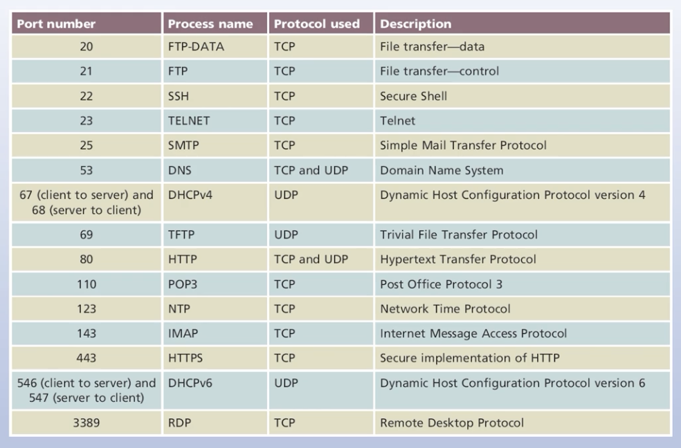
**Figure 1: Common ports and their usage**

### TCP Protocol
TCP is a connection-oriented protocol, it must make a connection with the destination before data can be sent. Once the transmission is completed the connection must then be closed. 

TCP offers full-duplex communication, meaning both the sender and receiver can send data at the same time.

A TCP connection is established in three stages:
1. Connection establishment with a three-way handshake
  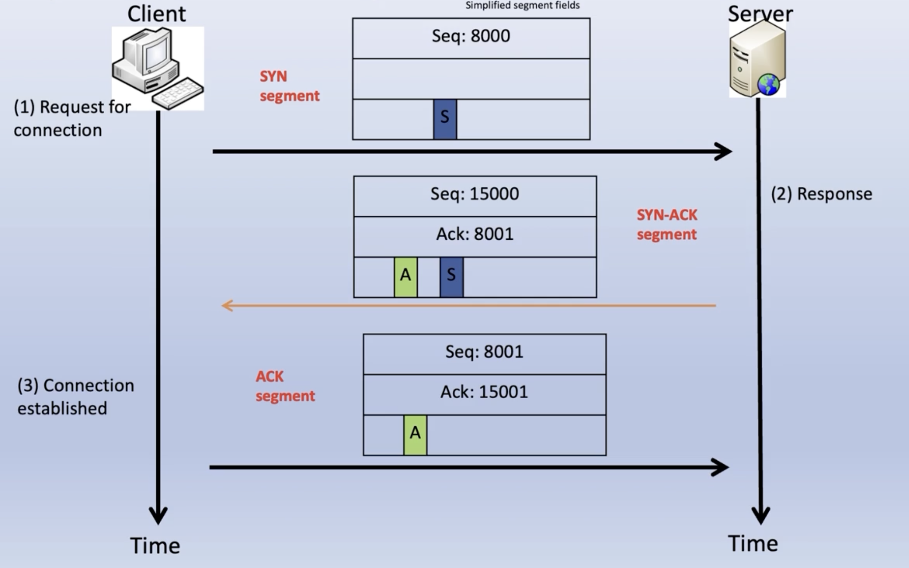
2. Data transmission
  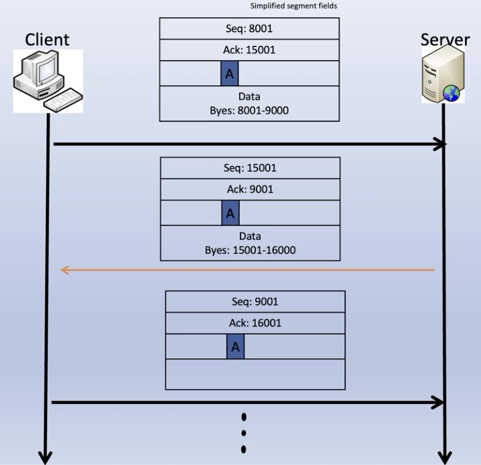
3. Connection termination with a four-way handshake
  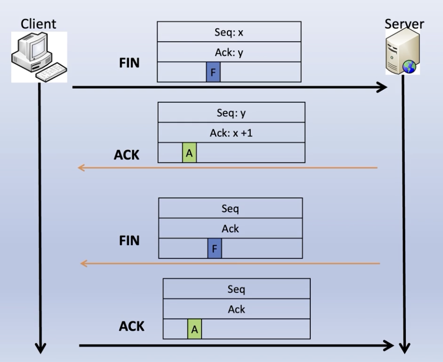

**TCP Features:**
- Error Control: TCP provides error control to ensure data integrity:
  - Uses Re-transmission timeout (RTO) to retransmit lost segments
  - When TCP sends a segment it times how long it takes for it to be received
  - Uses checksum to detect transmission errors
- Flow Control: TCP provides flow control to ensure that the network does not become overloaded.
  - Only a certain amount of data can be sent at any one time. This is controlled by a Sliding Window mechanism.
- Retry Mechanism: TCP provides a retry mechanism to ensure that a segment is sent again if it is lost.
  - If no acknowledgement is received within a certain time frame, the segment is resent.

### TCP Header
The TCP header consists of a:
- **16-bit source port:** Used to identify the sending port
- **16-bit destination port:** Used to identify the receiving port
- **32-bit sequence number:** Used to define the first byte number of the datagram with the number not always starting from zero.
- **32-bit acknowledgment number:** Used to indicate explicitly that a specific set of data was received successfully. It also indicates the next bytes expected sequence number from the other side of the communication.
- **9-bit Control Bits field:** A set of siz standard and three extended control flags used to indicate the purpose and contents of the segment.
- **16-bit Window field:** Used to indicate the size of the TCP receiver buffer. This is measured in bytes.
- **16-bit Checksum field:** Used to detect transmission errors.
- **16-bit Urgent Pointer field:** Used in conjunction with the urgent flag, this field indicates the end of the urgent data sent in the segment.

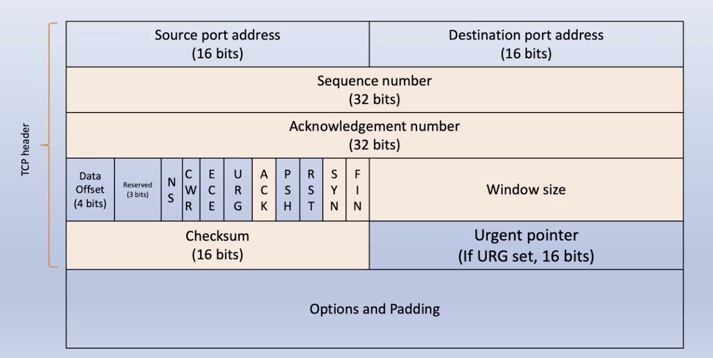

### UDP Protocol
UDP is a connectionless protocol, it does not make a connection with the destination before data can be sent. This comes with the advantage of being fast and simple however, due to this, the the data delivery service can be unreliable.

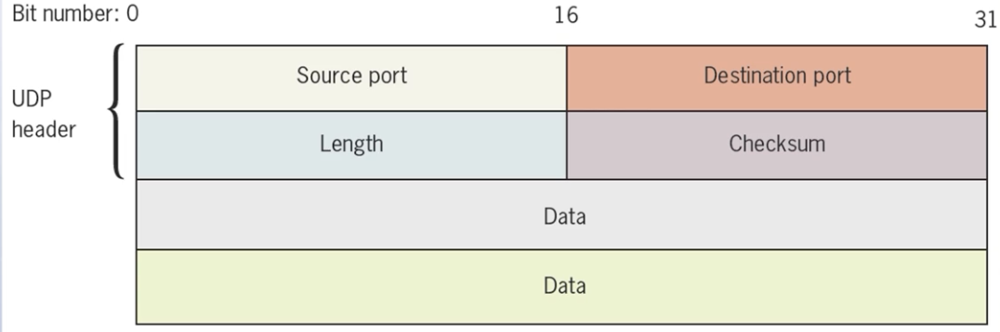

**UDP Features:**
- **No connection handling:** Each datagram is an independent message that the sender transmits without UDP providing any way to establish, manage, or close a connection.
- **No delivery guarantee:** Datagrams are not sequenced and are not acknowledged. This means that any datagram sent is not guaranteed to be delivered or received. The Application layer must provide tracking and retransmission mechanisms to ensure data is received.
- **No error checking:** There are no guarantees that the packets will be received correctly or even at all.

### ARP Protocol
The ARP protocol is used to resolve a logical IP address to a physical MAC address for LAN communication. ARP operates on both layers two and three of the OSI model.

Every frame contains both a MAC and IP source and destination address. When a packet is ready to be sent to the network access layer, the destination devices MAC address must be retrieved before the frame header can be constructed and, in turn, before data can be delivered.

The ARP protocol does this via a request/reply pair of transmission on the local network. First, the ARP protocol checks to see if the target host's MAC address is already in the ARP cache, if not the originator transmits a broadcast requesting the hardware address of the target host. The target host, upon receiving the request, responds unicast back with the hardware address of the target host.

### ARP Cache
To avoid sending requests to the same device multiple times, devices will store learning IP address-to-MAC address pairs in a temporary location in RAM. These ARP cache entries are not kept indefinitely and are purged within a matter of minutes after being used. This is to avoid the storage of outdated information which could result from a changed NIC or IP address.

An ARP request is sent as a broadcast address so that every host on the network records the mapping of requesters IP and MAC addresses to its ARP cache table for future reference.

### ARP Request
An ARP request consists of a two-step process: a request and a reply. 

- Direct delivery (A -> B):
  - A sends out a broadcast ARP request message to the network. B, C, and D will all receive the broadcast message but only B will respond with a unique ARP reply.
  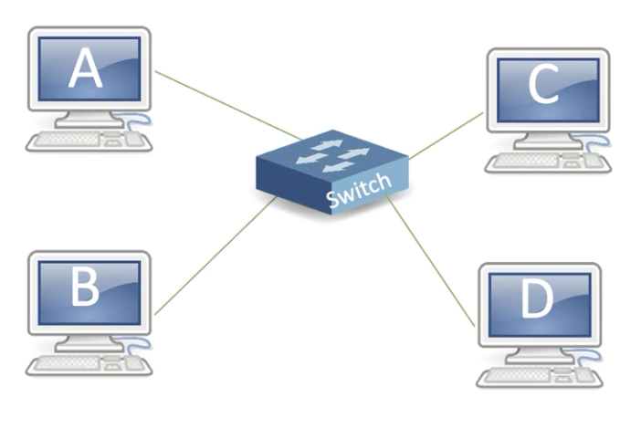
- Indirect delivery (A -> C):
  - A sends out a broadcast ARP request message to the routers MAC address. 
  - The router will then respond with an ARP reply message via unicast. 
  - Finally the router will uphold the received data and then process the relay.
    - The router will send out a broadcast ARP request to request for C's MAC address
    - C will respond with an ARP reply message via unicast
    - The router will re-package the data and forward the frame to A
  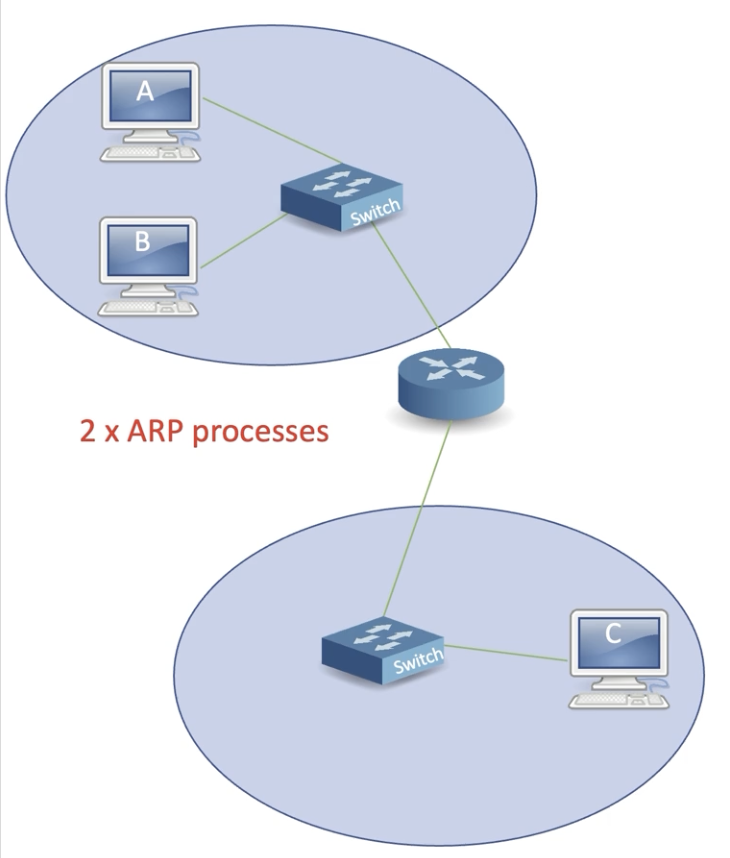

### ICMP Protocol
The ICMP protocol is a protocol that sits in the network layer and will report any errors, leaving the correction of them to higher level protocols. ICMP will always report back to the originator of the request with information about any errors, if any at all.

ICMP messages are encapsulated inside of IP datagrams before going down to the data link layer and include the first eight bytes of the problem datagram to allow the originator to determine the nature of the error.

**ICMP Features:**
- Assists in diagnosis of network problems sending error messages back to the originator of the request.
- Often occurs in pairs: queries and replies
- Assists in obtaining specific information from routers/hosts
- Is used by routers and hosts

### ICMP Message Types

#### Destination Unreachable
This error occurs when a router cannot forward a datagram. If this occurs, the router will send a "Destination Unreachable" message back to the originator and then drop the datagram.

| Code | Description |
|------|-------------|
| 0 | Network is unreachable |
| 1 | Host is unreachable |
| 2 | Protocol is unreachable |
| 3 | Port is unreachable |
| 4 | Fragmentation needed and DF flag set |

#### Time Exceeded
This error occurs when a router cannot forward a datagram because it has exceeded its time to live. When a packet is sent, its TTL is decremented by one at each hop. If the TTL reaches zero, the packet is dropped with the router who dropped the packet sending the "Time Exceeded" error message to the originator.

#### Echo Request/Reply
A host or router can send an echo-request message to another host or router to verify that the host is alive. The host or router will send an echo-reply message back to the originator of the request.

### Problem Solving Process

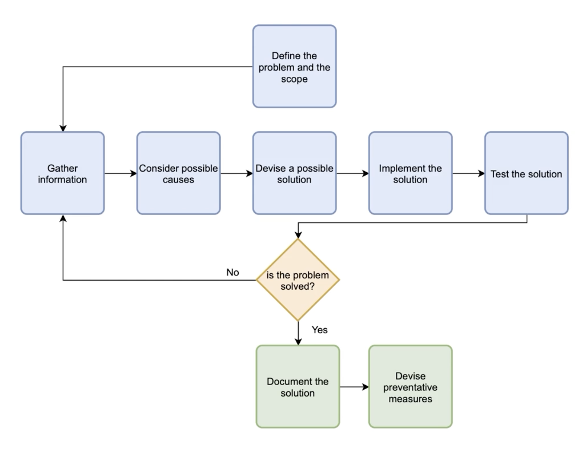

### Trial and Error
Trial and error is a method of problem solving that involves trying different solutions to a problem until the correct solution is found. This method is often used when the problem is not well understood or when the problem is not well defined.

This is however, not always the best approach and is not to be relied on exclusively.

### Solve by Example
Solve by example is a method of problem solving where you compare the thing that isn't functioning with something that does making modifications to the non-functioning item until it performs like the functioning item.

This method can only really be used when there is a working sample with a similar environment as the machine with the problem. When enacting this method, it's important to ensure not to make changes that could cause conflicts as well as caution not to destroy and pre-existing data.

### Replacement
The replacement method is only effective if the the problem source can be determined and the source is a defective part.

The rules of the replacement method are as follows:
- Narrow the list of potentially defective parts down to a few candidates.
- Make sure the correct replacement parts are available on hand
- Replace only one part at a time
- If the first replacement doesn't fix the problem, reinstall the original part before replacing the next part

### Step-by-Step with the OSI Model
This method can be done either top-down or bottom-up:
- Top-down: Starting at the application layer, keep testing at each layer until the problem is resolved.
- Bottom-up: Starting at the physical layer, keep testing at each layer until the problem is resolved.

### Common Problems
- Default gateway is not set:
  - The default gateway is the address of the router that the PC will use to access the outside world. It must be physically and logically connected.
- Subnetting error:
  - Is the device in the same subnet as other devices on the local link
  - Is the subnet mask correct
- Cabling:
  - Not connected correctly
  - Damaged
  - Incorrect cabling used
- Routing:
  - Wrong or missing entries
  - Summarisation error
- Routing interfaces:
  - Interfaces are disabled by default
  - Clock rate on DCE interfaces must be set

<br />

<h2 id="week7">Week 7: Application-layer protocols</h2> 

### DNS
DNS is a name-to-address resolution protocol designed to convert human readable names into IP address on a network. DNS keeps a list of computer names and their IP addresses allowing the user to access a network by name rather than by IP address.

For example, a user can enter `www.google.com` into their browser. The DNS client service will then contact the DNS server specified in the network configuration and request the IP address of `www.google.com`. The DNS server will then return the IP address of `www.google.com` to the DNS client service which will then use the IP address to access the website.

DNS is a hierarchical system with the root DNS server at the top and the TLD DNS servers at the bottom. The root DNS server contains all top-level domains of the internet.

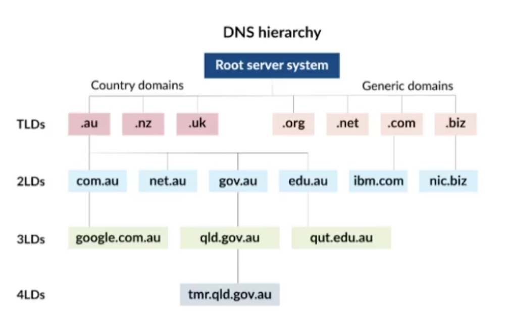

Second-level domains are usually the name of a company or institution. The subdomain level is optional and can consist of names separated by a period. The host level represents individual computers hosting network services. For example, `www.qut.edu.au` has the following hierarchy:
- 'au' is the top-level domain
- 'edu' is the second-level domain
- 'qut' is the subdomain domain
- 'www' is the hostname

### DNS Server
DNS servers are composed of the following:
- DNS zones: A database containing all primary hostnames and their corresponding IP addresses.
- Resource records: The unit of information entry in a DNS zone.
- Cache: A temporary database containing all hostnames and their corresponding IP addresses that have been recently queried.
- Root hints: A list of all IP addresses of internal root servers.
- DNS Server service: A service that runs in the background listening for DNS queries on UDP port 53.

### DNS Client
The DNS client, also referred to as the resolver, is responsible for communicating with the DNS server to resolve hostnames to IP addresses.

### Authoritative and Non-Authoritative Answers
An authoritative answer occurs when the DNS server hosting the DNS record responds to the DNS client. A non-authoritative answer occurs when the DNS server provides answers that are not from its zone file.

### Iterative and Recursive Queries
A recursive query is a query that demands a resolution or answer. The queried DNS server must provide the information requested by the resolver. An iterative query is a query that does not demand a resolution or answer. The queried DNS server will only provide the information if it has it in its cache.

### Web Client 
The web client is the software that the user uses to access the web. This can be a web browser, a web crawler, or a web proxy. The web client sends HTTP requests to the web server.

### Web Server 
When queried, the web server sends HTTP responses to the web client providing web content that can be accessed through the internet.

### Web Client/Server Communication
The client first initiates contact with the web server to request a service via a HTTP request. This is usually done by entering a URL into a web client such as a web browser.

The following steps then occur:
1. The browser first connects to a DNS server to resolve the targets IP address.
2. The DNS server replies with the corresponding IP address for the queried web server.
3. The web browser then connects to the web server via a HTTP request with a TCP 3-way handshake.
4. The web server receives the request and checks for the request message. Assuming the page exists, the web server will then reply with it otherwise sending a HTTP 404 response.
5. The web browser receives the response containing the requested page, closing the connection with the DNS server.
6. The browser then parses through the web page information and looks for other page elements needed for loading the web page.
7. For each identified element, the browser will make an additional HTTP request to the server for the element.
8. Once the browser has loading all the elements (images, info, scripts, etc.) it will then display the web page to the user.

### HyperText Markup Language (HTML)
HTML is a markup language used to create web pages. It is composed of tags that are used to define the structure of a web page. For example, the `<p>` tag is used to define a paragraph.

For example:
```html
<html>
  <head>
    <title>My Web Page</title>
  </head>
  <body>
    <h1>My Web Page</h1>
    <p>This is my web page.</p>
  </body>
</html>
```

### HTTP
The HTTP protocol was originally created as a way to transfer static web pages written in HTML. However, it is now used for general file transfer and downloading/displaying multimedia files.

HTTP, by default, operates on port 80 although any port can be used. HTTP is an application layer protocol that uses TCP as its transport layer protocol. HTTP functions as a request-response protocol in the client-server computing model and can identify and locate network resources by a URI.

### URL
A URL is a unique identifier for a resource on the internet. Every object on the internet has a URL. A URL is composed of the following:
- Service type (http, ftp, etc.)
- Host/Domain name (`www.qut.edu.au`, `opensaurce.com`)
- Directory or Subdirectory information (`/study`, `/utilities`)
- File name (`example.htm`, `installer.exe`)

### Email Protocols
There are three main email protocols:
1. Post Office Protocol v3 (POP3)
2. Internet Message Access Protocol v4 (IMAP4)
3. Simple Mail Transfer Protocol (SMTP)

#### Post Office Protocol v3 (POP3)
POP3 is a protocol that runs on TCP port 110 that allows a user to download emails from a remote server to a local client. A POP3 client will download an email from the mail server located on the users ISP server, then delete the email from the server. 

#### Internet Message Access Protocol v4 (IMAP4)
IMAP4 is a protocol that runs on TCP port 143 that downloads only an emails header initially, downloading the full email only when requested. IMAP4 is designed to store messages on the mail server.

#### Simple Mail Transfer Protocol (SMTP)
SMTP is a protocol that runs on TCP port 25 that allows a user to send emails to a remote server. SMTP and POP3 work in conjunction with each other to allow users to send and receive emails.

### File Transfer Protocol (FTP)
FTP is a client/server protocol running on TCP ports 20 and 21 that allows users to transfer files between a client and a server. 

Port 21 is used for sending user control commands while port 20 is used for transferring the file data.

An FTP site can be accessed in three main ways:
1. Via a browser using the `ftp://`
2. Via a FTP client such as FileZilla
3. Via a command line interface using the `ftp` command

It's very important to note that FTP is not a secure protocol due to user credentials and data being sent in plaintext.

### Telnet
Telnet is a protocol that runs on TCP port 23 that allows a user to connect to a remote server and execute commands. Much like FTP, Telnet is not a secure protocol.

### Secure Shell (SSH)
SSH is a protocol that runs on TCP port 22 that allows a user to connect to a remote server and execute commands. The difference here between SSH and Telnet is that SSH is a secure protocol as it encrypts all data sent between the client and server.

### PuTTY
PuTTY is a free and open source graphical SSH and Telnet client. It is used to connect to remote servers via SSH or Telnet through a graphical interface.

### Dynamic Host Configuration Protocol (DHCP)
DHCP is a protocol that runs on UDP port 67 and 68 that allows a client to automatically obtain an IP address, subnet mask, default gateway, and DNS server from a DHCP server.

DHCP Servers listen on UDP port 67 for IP address releases while using UDP port 68 for IP address requests.

A DHCP server is composed of the following:
- IP address scope: A range of IP addresses the server leases to clients
  - **Scope options**: Options that can be configured for the scope such as the default gateway, DNS server, subnet mask and more.
  - **Reservations**: A list of IP addresses that are reserved for specific clients. When a clients MAC address matches an address specified by a reservation, the reserved IP is leaded to the client instead of the next available IP address in the scope.
  - **Exclusions**: A list of IP addresses that are excluded from the scope. These addresses are not leased to clients.

**DHCP Lease Process:**
1. During the boot process, a DHCP client will broadcast a `DHCPDISCOVER` message to the network. This states that the client is looking for a DHCP server.
2. The DHCP server will reserve an IP address for the client and make a lease offer to the client. This is done by sending a `DHCPOFFER` message to the client via unicast.
3. The client will respond to the offer by sending a `DHCPREQUEST` message to the server via broadcast accepting the first offer to come back if multiple servers respond.
4. The DHCP server whose offer was accepted will respond with a `DHCPACK` message to the client via unicast. This message contains the IP address lease, IP address, subnet mask, default gateway, DNS server that the client will use and more.
5. Finally, a record of the lease is stored in a database on the DHCP server with the lease expiration date. When 50% of the lease time has elapsed, the client will attempt to renew the lease from the same server that issued the lease. If the server is unavailable, the client will wait until the lease reaches 87.5% of its expiration time before attempting to renew the lease from another server.

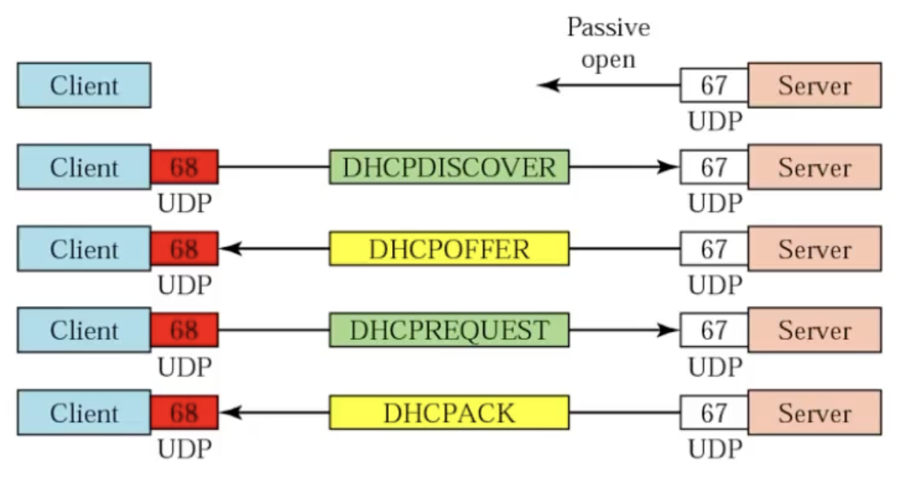

**Advantages:**
- DHCP allows easy tracking of assigned addresses and their machine in a large network
- Computers can easily be moved and request new IP configurations from the DHCP server
- IP lease time can be controlled
- IP addresses can be reusable for other computers on the network