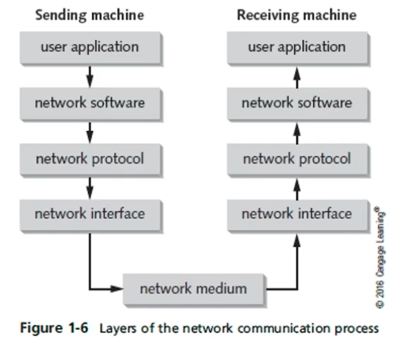

# CAB303 Study Guide | 2022 Semester 2

Dr Vicky Liu | Notes for CAB432 at the Queensland University of Technology

<h1>Table of Contents</h1>
<ul>
	<li><a href="#CAB303">CAB303: Networks</a></li>
	<ul>
		<li><a href="#week1">Week 1</a>: Introduction</li>
		<li><a href="#week2">Week 2</a>: </li>
		<li><a href="#week3">Week 3</a>: </li>
		<li><a href="#week4">Week 4</a>: </li>
		<li><a href="#week5">Week 5</a>: </li>
		<li><a href="#week6">Week 6</a>: </li>
		<li><a href="#week7">Week 7</a>: </li>
		<li><a href="#week8">Week 8</a>: </li>
		<li><a href="#week9">Week 9</a>: </li>
		<li><a href="#week10">Week 10</a>: </li>
		<li><a href="#week11">Week 11</a>: </li>
		<li><a href="#week12">Week 12</a>: </li>
		<li><a href="#week13">Week 13</a>: </li>
	</ul>
</ul>

 

<h1 id="CAB303">CAB303: Networks</h1>

Building on your digital systems knowledge, you will be introduced to practical and theoretical knowledge on a wide range of modern networking topics to be able to design, implement and maintain network-based applications. You will participate in practical networking exercises to provide hands-on experience with network-based computing.

 

<h2 id="week1">Week 1: Introduction</h2>

### Advanced Research Projects Agency (ARPA)
The Advanced Research Projects Agency, know as the ARPANET, was formed by the US within the Department of Defense (DoD) in response to the USSR's first artificial earth satellite. It was developed to establish a US lead in science and technology in 1957.

### Network Control Protocol (NCP)
NCP was the first standard operational packet-switching protocol on ARPANET standardising the ARPANET network interface. NCP provided the middle layer of the protocol stack and enabling services such as email and file transfer allowing people to read and write data from computers and devices remotely by. Robert Khan and Vinton Cert took these concepts building upon NCP to develop TCP/IP.

### Interface Message Processor (IMP)
During 1960 to 1989, IMP was the primary packet switching node used to interconnect participating networks to the ARPANET. The IMP was the first generation of gateways with the documents being the first of a series of standardised documents published by the Internet Engineering Task Force (IETF). An IMP was a Honeywell DDP-516 mini-computer consisting of special purpose interfaces and software.

### Networking Terminology
- **Local Area Network (LAN)**
  - A network that interconnects devices within a limited geographic area. e.g. university campus, homes.

- **Wide Area Network (WAN)**
  - Uses the services of third-party communication providers to carry network traffic from one location to another.

- **Metropolitan Area Networks (MAN)**
  - Uses WAN technologies to interconnect LANs in a specific geographic region, such as a county of a city.

- **Inter-network**
  - A network collection of LANs that are tied together by devices such as routers.

- **Internet**
  - A worldwide public inter-network. Uses protocols such as TCP/IP and HTTP to transfer and view information.

- **Intranet**
  - A private inter-network in which devices and servers are only available to those users connected to the internal network.

- **Extranet**
  - An enterprise network that extends to external users (e.g. suppliers, vendors, partner, clients) to access internal resources.

### Packets (Frames, Bits, Segments)
Packets, also known by many names such as frames, bits, or segments, are small collections of data that are sent across a network. These collections contain information such as a source, destination IP address, data and more.

### Frames
Frames are packets that contain a source and destination MAC address. The process of adding an IP address and MAC address to a chunk of data is called encapsulation. Information added to the front of the data chunk is called a header while information added to the end is called a trailer.

### Bits
A bit is a binary value typically represented by a 0 and 1 corresponding to an off and on electrical signal. Bits are the smallest incremental piece of data a computer can support.

### Packets and Frames
Computers typically transfer information across a network in short bursts consisting of around 1500 bytes of data. This is done due to many reasons:
1. It allows receivers to receive data from many other computers at the same time
2. Gives the receiving computer time to process the data 
3. Gives the sending computer the opportunity to receive data from other computers and perform other processing tasks
4. If an error occurs during transmission, only the chunks of data involved in the error need to be resent
5. Pauses between bursts allow other computers to transfer data during these pauses

### The Fundamentals of Network Communications
A computer network is a connection between two or more computers provided by cables or air waves. 

#### Network Interface Card (NIC)
An NIC is an add-on card that plugs into the motherboard expansion slot providing the computer a connection to the network. These come in two different types: wired and wireless.

#### Network mediums
A computer can connection to a connection by two different mediums:
1. An ethernet cable can be used to connect the NIC in a computer to a wired network device.
2. A wireless NIC can translate data into radio signals, transmitting these signals through the use of an antenna resulting in a wireless connection.

#### Interconnecting Device
An interconnecting device is used to allow two or more computers to communicate on a network without the need to connect directly to one another. There are a few common interconnecting devices such as:
- Routers: a router is used for connecting multiple networks together
- Switches: A switch is used for connecting multiple computers within a network
- Access Points (AP): Access points allow wireless devices to connect to a network

### Network Connectivity

- Peer-to-Peer
  - A Peer-to-Peer connection happens when a device connects directly to another device.

- Star Topology
  - A star topology connection occurs when devices connect to a singular access point whether wireless (AP) or wired (Switch).

### Software Components
- Network clients and servers
  - Network client software request information stored on another network computer or device
  - Network server software allow computers to share resources between each other
- Protocols
  - Protocols define rules and formats a computer must follow and use when sending packets of information across a network.
- NIC driver
  - An NIC driver receives data from protocols and forwards this data to the physical NIC

### Steps of Network Communication
1. An application tries to access a network resource by sending a message.
2. The client software formats this message and passes it along on to the network protocol.
3. The protocol packages the message in a format suitable for the network and sends it to the NIC driver.
4. The NIC driver finally sends data in a request to the NIC card to be converted into the necessary signals needed to be transmitted on the network.

### Layers of the Network Communication Process
These layers represent each step required for a client to access a network resource. Each layer has specific task with each layer working together.

