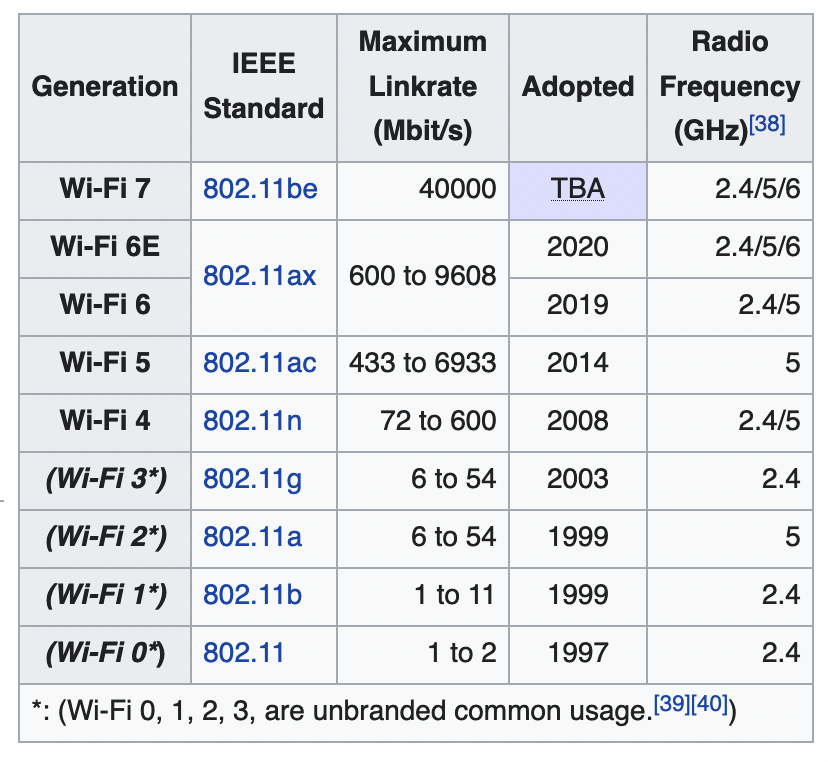

# CAB303 Study Guide | 2022 Semester 2

Dr Vicky Liu | Notes for CAB432 at the Queensland University of Technology

<h1>Table of Contents</h1>
<ul>
	<li><a href="#CAB303">CAB303: Networks</a></li>
	<ul>
		<li><a href="#week1">Week 1</a>: Introduction</li>
		<li><a href="#week2">Week 2</a>: Network Media, Ethernet, and Wi-Fi</li>
		<li><a href="#week3">Week 3</a>: </li>
		<li><a href="#week4">Week 4</a>: </li>
		<li><a href="#week5">Week 5</a>: </li>
		<li><a href="#week6">Week 6</a>: </li>
		<li><a href="#week7">Week 7</a>: </li>
		<li><a href="#week8">Week 8</a>: </li>
		<li><a href="#week9">Week 9</a>: </li>
		<li><a href="#week10">Week 10</a>: </li>
		<li><a href="#week11">Week 11</a>: </li>
		<li><a href="#week12">Week 12</a>: </li>
		<li><a href="#week13">Week 13</a>: </li>
	</ul>
</ul>

 

<h1 id="CAB303">CAB303: Networks</h1>

Building on your digital systems knowledge, you will be introduced to practical and theoretical knowledge on a wide range of modern networking topics to be able to design, implement and maintain network-based applications. You will participate in practical networking exercises to provide hands-on experience with network-based computing.

 

<h2 id="week1">Week 1: Introduction</h2>

### Advanced Research Projects Agency (ARPA)
The Advanced Research Projects Agency, know as the ARPANET, was formed by the US within the Department of Defense (DoD) in response to the USSR's first artificial earth satellite. It was developed to establish a US lead in science and technology in 1957.

### Network Control Protocol (NCP)
NCP was the first standard operational packet-switching protocol on ARPANET standardising the ARPANET network interface. NCP provided the middle layer of the protocol stack and enabling services such as email and file transfer allowing people to read and write data from computers and devices remotely by. Robert Khan and Vinton Cert took these concepts building upon NCP to develop TCP/IP.

### Interface Message Processor (IMP)
During 1960 to 1989, IMP was the primary packet switching node used to interconnect participating networks to the ARPANET. The IMP was the first generation of gateways with the documents being the first of a series of standardised documents published by the Internet Engineering Task Force (IETF). An IMP was a Honeywell DDP-516 mini-computer consisting of special purpose interfaces and software.

### Networking Terminology
- **Local Area Network (LAN)**
  - A network that interconnects devices within a limited geographic area. e.g. university campus, homes.

- **Wide Area Network (WAN)**
  - Uses the services of third-party communication providers to carry network traffic from one location to another.

- **Metropolitan Area Networks (MAN)**
  - Uses WAN technologies to interconnect LANs in a specific geographic region, such as a county of a city.

- **Inter-network**
  - A network collection of LANs that are tied together by devices such as routers.

- **Internet**
  - A worldwide public inter-network. Uses protocols such as TCP/IP and HTTP to transfer and view information.

- **Intranet**
  - A private inter-network in which devices and servers are only available to those users connected to the internal network.

- **Extranet**
  - An enterprise network that extends to external users (e.g. suppliers, vendors, partner, clients) to access internal resources.

### Packets (Frames, Bits, Segments)
Packets, also known by many names such as frames, bits, or segments, are small collections of data that are sent across a network. These collections contain information such as a source, destination IP address, data and more.

### Frames
Frames are packets that contain a source and destination MAC address. The process of adding an IP address and MAC address to a chunk of data is called encapsulation. Information added to the front of the data chunk is called a header while information added to the end is called a trailer.

### Bits
A bit is a binary value typically represented by a 0 and 1 corresponding to an off and on electrical signal. Bits are the smallest incremental piece of data a computer can support.

### Packets and Frames
Computers typically transfer information across a network in short bursts consisting of around 1500 bytes of data. This is done due to many reasons:
1. It allows receivers to receive data from many other computers at the same time
2. Gives the receiving computer time to process the data 
3. Gives the sending computer the opportunity to receive data from other computers and perform other processing tasks
4. If an error occurs during transmission, only the chunks of data involved in the error need to be resent
5. Pauses between bursts allow other computers to transfer data during these pauses

### The Fundamentals of Network Communications
A computer network is a connection between two or more computers provided by cables or air waves. 

#### Network Interface Card (NIC)
An NIC is an add-on card that plugs into the motherboard expansion slot providing the computer a connection to the network. These come in two different types: wired and wireless.

#### Network mediums
A computer can connection to a connection by two different mediums:
1. An ethernet cable can be used to connect the NIC in a computer to a wired network device.
2. A wireless NIC can translate data into radio signals, transmitting these signals through the use of an antenna resulting in a wireless connection.

#### Interconnecting Device
An interconnecting device is used to allow two or more computers to communicate on a network without the need to connect directly to one another. There are a few common interconnecting devices such as:
- Routers: a router is used for connecting multiple networks together
- Switches: A switch is used for connecting multiple computers within a network
- Access Points (AP): Access points allow wireless devices to connect to a network

### Network Connectivity

- Peer-to-Peer
  - A Peer-to-Peer connection happens when a device connects directly to another device.

- Star Topology
  - A star topology connection occurs when devices connect to a singular access point whether wireless (AP) or wired (Switch).

### Software Components
- Network clients and servers
  - Network client software request information stored on another network computer or device
  - Network server software allow computers to share resources between each other
- Protocols
  - Protocols define rules and formats a computer must follow and use when sending packets of information across a network.
- NIC driver
  - An NIC driver receives data from protocols and forwards this data to the physical NIC

### Steps of Network Communication
1. An application tries to access a network resource by sending a message.
2. The client software formats this message and passes it along on to the network protocol.
3. The protocol packages the message in a format suitable for the network and sends it to the NIC driver.
4. The NIC driver finally sends data in a request to the NIC card to be converted into the necessary signals needed to be transmitted on the network.

### Layers of the Network Communication Process
These layers represent each step required for a client to access a network resource. Each layer has specific task with each layer working together.

### Network Architecture
Network architecture is the structural layout of a network including:
- Its physical components and their functional organisation and configuration
- Its operational principles and procedures
- Its data formats

There are two models that can be used when describing a networks architecture:
1. The TCP/IP protocol suite
2. The Open System Interconnection (OSI) model

Both of these models use layers to describe the software and hardware needed to transmit data between devices.

### The Open Systems Interconnection (OSI) reference model
The OSI model was proposed by the International Organisation for Standardisation (ISO) to provide a common framework for developers and students to learn from. It was designed to be applied to most networking protocols therefor is not specific to any protocol suite.

The OSI model is made up of seven layers and shows how data travels from one device to another on any given network. Each layer provides its services to the layer above until the data reaches the application layer where it provides the services to the user application. Each layer on a device behaves as if it were connecting with the same layer on the connecting device, this is known as peer communication between layers.

### Encapsulation in Networking
Control information is either added or removed from a layer depending on whether the data is being sent or received. The process of adding additional control information to data as it moves through each layer is called encapsulation. Encapsulation occurs in the sending device with the receiving device de-encapsulating the data.

The process of encapsulation can be shown through placing a letter into an envelope. On the envelope we write the address and sender's/receiver's name, this is the control information. The sender then places the letter into the envelope encapsulating the control information and contents of the letter. The receiver then removes the letter from the envelope thus de-encapsulating the control information and contents.

### OSI Layers

#### The Application Layer (Layer 7)
The application layer provides many interfaces for which a user can use to access networking services. 

**Common Protocols:**
- Hypertext Transfer Protocol (HTTP)
- File Transfer Protocol (FTP)
- Simple Mail Transfer Protocol (SMTP)

**Possible Problems:**
- Missing or misconfigured client or server software
- Incompatible or deprecated commands used to communicate between client and server

#### The Presentation Layer (Layer 6)
The presentation layer handles data formatting and translation and can support data encryption/decryption. For outgoing messages the data is converted into a format specified by the application layer. For incoming messages the conversion is reversed if required by the receiving application.

#### The Session Layer (Layer 5)
The session layer handles the creation and management of sessions, ongoing communications, between multiple devices. The layer handles connection setup ahead of data transfers and session shutdowns once the session ends.

The session layer also handles checkpointing and manages the mechanics of ongoing conversations such as identifying which side can transmit data when and how long for. 

**Common Network Functions:**
- Name lookup
- User login
- User logoff

#### The Transport Layer (Layer 4)
The transport layer manages the transfer of data from one application to another across a network. It does this by first breaking down the data into smaller chunks called segments. Segmenting is important because every network technology has a maximum frame size, called the Maximum Transmission Unit (MTU), and the data sent must not exceed this.

The transport layer also handles flow control and acknowledgements to ensure reliability as well as handling the re-sequencing of segments into the original data on the receipt.

#### The Network Layer (Layer 3)
The network layer performs many tasks such as
- Logical addressing
- Mapping logical network addresses (IP addresses) into physical addresses.
- Routing e.g. selects the best path

**Common Protocols:**
- Internet protocol (IP)
- Address Resolution Protocol (ARP)
- Internet Control Message Protocol (ICMP)

**Possible Problems:**
- Incorrect IP addresses or subnet masks
- Incorrect router configuration
- Router operation errors

#### The Data Link Layer (Layer 2)
The data link layer is an intermediate layer between the network and physical layers which defines how computers access the network medium. The data link layer works with frames consisting of both a header and a trailer with the trailer component being labeled as a frame check sequence (FCS) which contains a Cyclic Redundancy Check (CRC) code. CRC is an error detecting code which is commonly used in network communications. NICs and switches operate at this layer.

**Possible Problems:**
- Collisions
- Invalid frames

#### The Physical Layer (Layer 1)
The physical layer deals with the incoming and outgoing messages. It converts bits into signals for outgoing messages and signals into bits for incoming messages. The physical layer also handles encoding with most components at this layer being repeaters and hubs.

**Possible Problems:**
- Incorrect media termination
- Electromagnetic interference or noise which scrambles a signal
- NICs and hubs can bne misconfigured or malfunctioning

 

<h2 id="week2">Week 2: Network Media, Ethernet, and Wi-Fi</h2>

### Network Media
- There are two major categories of network media: wired and wireless.
- There are two broad categories for cables: copper wire and fibre optic

The main differences between these two types are:
- Composition of signals, whether they use electricity or light
- Speed at which the signals can be sent
- Distance the signals can effectively travel

### Criteria for Choosing Network Media

- Bandwidth
  - How much data will need to be transmitted on the required network link?
  - What is the typical speed we would expect for our transfer rate to be useable?
  - How many users will be using the network at any given time?
- Distance
  - How far do we need a segment of the network to go?
  - What will be the maximum length of cable between two network devices?
  - Each cable type can only transport data so far before the connection begins to weaken
- Interference
  - Wireless connections can be disrupted by environmental obstacles or other devices running on similar bandwidths:
    - Computers, refrigerators, fans, lighting fixtures, or any other motorised devices
    - Weather conditions such as lightning and fog can effect wireless signal integrity 
  - Wired connections can be disrupted by other equipment producing electromagnetic interference:
    - 802.11b/g use an RF range of 2.4GHz
    - Devices sharing a channel can cause noise which in turn weakens other signals
    - Electromagnetic interference (EMI)
    - Radio Frequency Interference (RFI)
  - The density of objects can create interference or connection issues:
    - Concrete/steel walls are difficult for a signal to pass through
- Ease of Installation
  - How easy is the technology to install in the given location?
  - Need to consider the environment the connection is going to be in
- Total Cost 
  - The total cost of the installation, network media, and ongoing maintenance
- Mobility
  - Will the devices using the connection be moved around a lot or be fixed in-place?
- Security
  - How secure is the network media?
  - What data is being sent over the connection, is it sensitive?
  - What will happen if the data being sent is intercepted?
  - Copper wire is susceptible to electronic eavesdropping
  - Fiber-optic media carries light signals and therefor is not easily susceptible to interference or eavesdropping

  ### Bandwidth
  The network bandwidth is the total amount of data that can be carried from one point to another for any given time period (generally a second). This amount is expressed using bits per second (bps) with speeds generally measured in the millions of bits per second, megabits per second (Mbps), or billions of bits per second, gigabits per second (Gbps).

   

  **Rates:**
  - 1 Mbps = 0.125 MB/s (Megabytes per second)
  - 100 Mbps = 12.5 MB/s
  - 1 Gbps = 125 MB/s

### Types of Cables

#### Coaxial Cable
Coaxial cables, or coax cables, were once the predominant form of network cabling. This was because it was relatively inexpensive and was easy to install while still providing a decent connection. Coaxial cables started to be phased out in the early 1990's but are still used today primarily in connecting cable modems to wall outlets installed by TV/internet providers.

#### Twisted-Pair Cable
These cables are used in most local area network connections. There are two types of twister-pair cables:
- Unshielded Twisted-Pair (UTP)
  - This are the most commonly used one out of the pair
  - Cheaper to use
  - More flexible than the shielded version
- Shielded Twisted-Pair (STP)
  - Cables are shielded to help stop interference from electromagnetic noise
  - More expensive

Twisted pair cabling is classified by categories with twisted pair cables currently being in category 1 through to category 8 although categories 1, 2 and 4 are nearly obsolete. Categories 5e, 6, and 7 UTP cabling is the most popular type of UTP used now days.

The twists in the wires are necessary to improve their resistance to crosstalk from other wires and EMI from outside sources. Shielding can additionally be layed on to eliminate more interference.

Twister-pair cables use RJ-45 connectors to connect to computers, hubs, switches and RJ-45 wall jacks. To put RJ-45 plugs on the end of twisted-pair cable the wires are punched down into terminal blocks on a jack or patch panel.

Some common tools used in this process are:
- Wire cutters
- Crimping tool
- Cable tester
- Punchdown tool
- Cable stripper
- RJ-45 plugs/jacks

It's important when making a cable or terminating a cable at a jack or path panel that the colour wires are arranged in the correct order. There are two standards from the Telecommunications Industry Association (TIA)/Electronic Industries Alliance (EIA):
- T-568A
- T-568B

#### Fiber-Optic Cable
Fiber-optic cables transmit pulses of light instead of electrical signals. These cables are composed of a cylinder of glass fiber called the core encased in a concentric layer of glass called the cladding. Finally the fiber is jacketed in a thin transparent plastic material called the buffer.

Information is sent in a beam of light bouncing down the glass or plastic pipe. These cables provide a high data capacity over long distances immune to electrical interference and eavesdropping. As expected however, there are higher installation and maintenance costs tied to these cables:
- They are more difficult and time consuming to install
- The connectors and test equipment required are relatively more expensive than the copper substitutes
- Birds typically peck at the fiber cable jackets to use as bits of nesting material
- Beavers and mice use exposed fiber cables to sharpen their teeth
- Ants like to eat the plastic shielding
- Sharks have been known to damage fiber cabling when laid underwater

There are two major types of fiber-optic cables:
1. Single-mode fiber (SMF):
    - Includes a single, small-diameter fiber at the core (8 microns)
    - Generally uses a laser light source
    - Spans the longest distance of the two
    - Generally used in higher-bandwidth applications
2. Multi-mode fiber (MMF)
    - Uses a larger diameter fiber at the core (50 and 62.5 microns)
    - Costs less that SMF
    - Uses an LED for its light source
    - Spans shorter distances

#### Serial Communications
A serial link is a point-to-point link between two devices where bits are transmitted sequentially over a single channel. In theory, transferring bits in parallel is faster however, this method suffers from problems with synchronisation and higher costs.

The original serial standard, RS-232, was introduced in the 1960s and is now mostly replaced by USB.

### Straight-Through vs Crossover Cables
Standard path cables are considered straight-through cables as the same wiring standard is used on both ends of the cable. Crossover cables on the other hand use the T-568A standard on one side of the cable and the T-568B standard on the other side.

Crossover cables cross the transmit and receive wires so that the transmit on one end connects to the receive on the other. This is usually needed when two devices of the same type need to be connected to one another.

The need for crossover cables has been eliminated in todays time with advancements in equipment. G/Ethernet comes with automatic medium-dependant interface crossover (Auto-MDIX) detecting whether a crossover or straight-though cable is needed and automatically configuring the network interface card accordingly. There are however, still cases in which crossover cables are still needed when connecting devices of the same type together.

### DTE vs DCE Devices
Devices that communicate over a serial interface are divided into two types:
1. Data Terminal Equipment (DTE)
    - An end instrument that is used to convert user information into signals or re-convert received signals.
2. Data Communications Equipment (DCE)
    - Typically, a modem or other piece of data communications equipment

When a connection between two DTE devices is needed without a modem, a special type of cable called a null modem is required. Generally, DCE devices provide the clock rate while the DTE device synchronises with that provided clock rate.

### Benefits of Wireless Connections
- Wireless connections create a temporary connection to wired connections
- Establishes backup or contingency connectivity for existing wired networks
- Extends a networks span beyond the reach of wire-based or fiber-optic cabling. This is especially useful in older buildings where rewiring may be too expensive
- Wireless allows businesses to provide customers with access to the internet without the need for them to hook any wires up
- Allows users to move around the office without the restrictions of moving wires or physical connections

### Wireless LAN Components
There are many components that help provide a device with wireless LAN capabilities:
- The network interface attaches to an antenna and an emitter instead of a cable
- A wireless access point (AP)
  - This is a device which has an antenna and transmitter to send and receive wireless traffic
  - Has ports to connect to the wired side of the network
  - Shuttles traffic back and forth between a networks wired and wireless sides
  - Most small business and home networks use a wireless router to do this. A wireless router is a device which combines the functions of an AP, a switch and a router all in one.

### Wireless vs Wired Networking
- Speed
  - Wired ethernet is faster than wireless however Wi-Fi has become faster over the recent years
- Stability
  - Wireless is more susceptible to environmental factors as radio waves can be blocked by walls and floors and can interfere with microwaves, cordless phones and more
- Mobility, installation and convenience
  - Wi-Fi allows for greater mobility of devices as they are not restricted by cabling
- Security
  - Wireless transmissions can be intercepted easier than wired transmissions

### Media Access Controller (MAC) Addresses
MAC addresses are unique 48-bit addresses expresses in 12 hexadecimal digits that are stored in ROM on the NIC. This 48-bit address is made up of two 24-bit numbers with one half referred as the manufacturer ID (OUI) and the other being the device's unique serial number assigned by the manufacturer. 

The broadcast MAC address is ff-ff-ff-ff-ff-ff.

### Wireless NICs
Wireless NICs must be chosen according to the type of wireless AP being used. Typically this would either be 802.11ac, 802.11ax, 802.11ax-2021 or 802.11 a/b/g/n where each letter refers to the wireless network standard the device supports.

Wireless NICs connect to a network using a service set identifier (SSID) which is the name assigned to the wireless network. Depending on the networks security configuration, a security key or username and password may need to be entered for access.

An NIC has many functions depending on what connection is being processed.

For incoming messages the NIC will:
- Receive bit signals and assemble them into frames
- Verify the destination address
- Remove the frame header and sends the resulting packet to the network protocol

For outgoing messages the NIC will:
- Receive packets from the network layer
- Create frames by adding MAC addresses and error checking
- Convert frames into bit signals suitable for the medium and transmit them

### Ethernet
Ethernet is a wired connection used in LAN, MAN and WAN networks. It was introduced in 1980 and standardised in 1983 as IEEE 802.3. The protocol has evolved and improved over time with the system now having three main speeds:
- 10Mbps
- 100Mbps
- 1000Mbps

Ethernet can support 10Mbps all the way to 10Gbps with most NICs/switches operating at 10/100/1000Mbps.

### Ethernet Media Access
Media access method is a set of rules governing how and when that medium can be accessed for transmission. Ethernet uses Carrier Sense Multiple Access with Collision Detection (CSMA/CD):
- Carrier Sense: The connection must listen and hear silence before sending data
- Multiple Access: If two or more stations hear silence, multiple stations are allowed to transmit data at the same time
- Collision Detection: If two or more stations transmit at the same time and a collision occurs and is detected by the NIC, all stations must retransmit the sent data

Ethernet handles errors using the best-effort delivery system, you hope the data gets to the destination but there is no acknowledgement either way. It's the job of the network protocols and applications to ensure the delivery of data. 

Ethernet will detect damaged frames by using the error-checking code in the frames trailer, this is called a Cyclic Redundancy Check (CRC). Ethernet can also use CRC to detect if any data has been changed during transmission. If a frame is detected as damaged, it is discarded with no notification.

### Ethernet Addressing
In ethernet, each station has a physical MAC address. Incoming frames must match the NIC's address or broadcast address and, once processed by the NIC, the incoming frames are sent to the network protocol for further processing.

### Ethernet Frames
Ethernet has four different frame types depending on the protocol being used to send the frame.

The ethernet II frame type is used by TCP/IP where each frame must be between 64-1518 bytes. Each frame consists of:
- Destination MAC
- Source MAC
- Type
- Data
- FCS

### Ethernet Standards
Ethernet standards are expressed through an XbaseY format where x designates the speed of transmission and Y specifies the type of media (T = twisted-pair, FX = fiber optic).

#### 10BaseT (outdated)
- Uses two of the four wire pairs
- Runs over Category 3 or higher UTP cabling
- Is highly susceptible to collisions and is now obsolete

#### 100BaseTX
100BaseTX is a common variety of Ethernet.
- Uses two of the four wire pairs
- Runs over Category 5 or higher UTP
- There are two types of 100BaseTX hubs
- Switches can be used to interconnect multiple hubs

#### 100BaseFX
100BaseFX is the fiber optic standard of Ethernet.
- Runs over two strands of fiber optic cabling
- Is typically used as the backbone cabling between switches
- Used to connect clients or servers when there is a need for the transmission to be immune to noise and eavesdropping

#### 1000BaseT Ethernet
1000BaseT Ethernet, also know as Gigabit Ethernet, runs over Category 5 or higher UTP and uses all four wire pairs.

#### 10GBaseT Ethernet
- Runs over four pairs of Category 6A or 7 UTP
- Only operates in full-duplex mode
- Is considered an expensive option even today
- Very useful for network servers as it allows them to keep up with desktop systems which typically operate at 1Gbps

#### 100BaseT4
- Uses all four pairs of wires in UTP Category 3 cable
- Is now considered obsolete

#### 1000BaseLX
- Uses fiber-optic media
- The "L" stands for "Long wavelength" laser
- Supports a maximum cable segment length of 5000 meters

#### 1000BaseSX
- Uses fiber-optic media
- The "S" stands for "Short wavelength" laser
- Cannot cover as much distance as long-wave lasers but is cheaper in comparison

#### 1000BaseCX
- Uses specially shielded, balanced, copper jumper cables
- Is also called "Twinax" or "Short-haul" copper cables

#### 10 Gigabit Ethernet IEEE 802.3ae
- Defined to only run on fiber-optic cabling
- Specifies a maximum distance of 40km
- This standard is primarily used for network backbones
- Has many varieties such as:
  - 10GBaseSR, 10GBaseLR, 10GBaseER, 10GBaseSW, 10GBaseLW, and 10GBaseEW

#### 40 Gigabit and 100 Gigabit Ethernet
- Fiber-optic cabling is the primary medium although there are provisions to use special copper assemblies over short distances.

### Wi-Fi
802.11 wireless networking standard, also called Wireless Fidelity (Wi-Fi) is essentially an extension to ethernet using airwaves instead of cabling. Wi-Fi can operate in one of two modes:
- Infrastructure:
  - The most common mode of Wi-Fi
  - Uses a central access point (AP)
- Ad hoc:
  - Uses no central device with data traveling from device to device like a bus
  - This is sometimes referred to as "Peer-to-Peer" mode

Wi-Fi can operate at 2.4Ghz and 5.0GHz frequencies with:
- 2.4GHz actually being 2.412 through to 2.484 divided into 14 channels spaced 5MHz apart
- 5.0GHz actually being 4.915 through to 5.825 divided into 42 channels of 10, 20, 40, 80, and 160MHz each

### Wi-Fi Access Methods and Operation
Unfortunately with Wi-Fi, a sending station cannot hear if another station has begun transmitting or not so it is unable to use CSMA/CD. Instead Wi-Fi devices use Carrier Sense Multiple Access with Collision Avoidance (CSMA/CA). This can optionally be used with request-to-send/clear-to-send (RTS/CTS) packets and acknowledgements.

CSMA/CA Protocol Steps:
1. Sender node (A) has some data to transmit
2. (A) checks if the media is free or not
  - Optionally, the sending not can transmit an RTS (Request to Send) packet to the access point
3. The sending node waits until all nodes have had time to receive the jam signal
4. Access point replies with a CTS (Clear to Send) packet
5. During transmission, the node monitors the media for an RTS signal from other surrounding nodes that may already be mid-transmission. If an RTS signal is received, it stops transmitting and retries after a random delay.

### Wi-Fi Security
Due to the fact that Wi-Fi can transmit data hundreds of feet away there is the fear that this data can be intercepted without you ever knowing. Wi-Fi should be protected by an encryption protocol that makes this data difficult to intercept and interpret. 

There are many encryption protocols with the main three being:
- Wired equivalent privacy (WEP)
- Wi-Fi protected access (WPA) as well as WPA2 and WPA3

However, not all devices support all three protocols. Older devices might only support WEP and/or WPA.